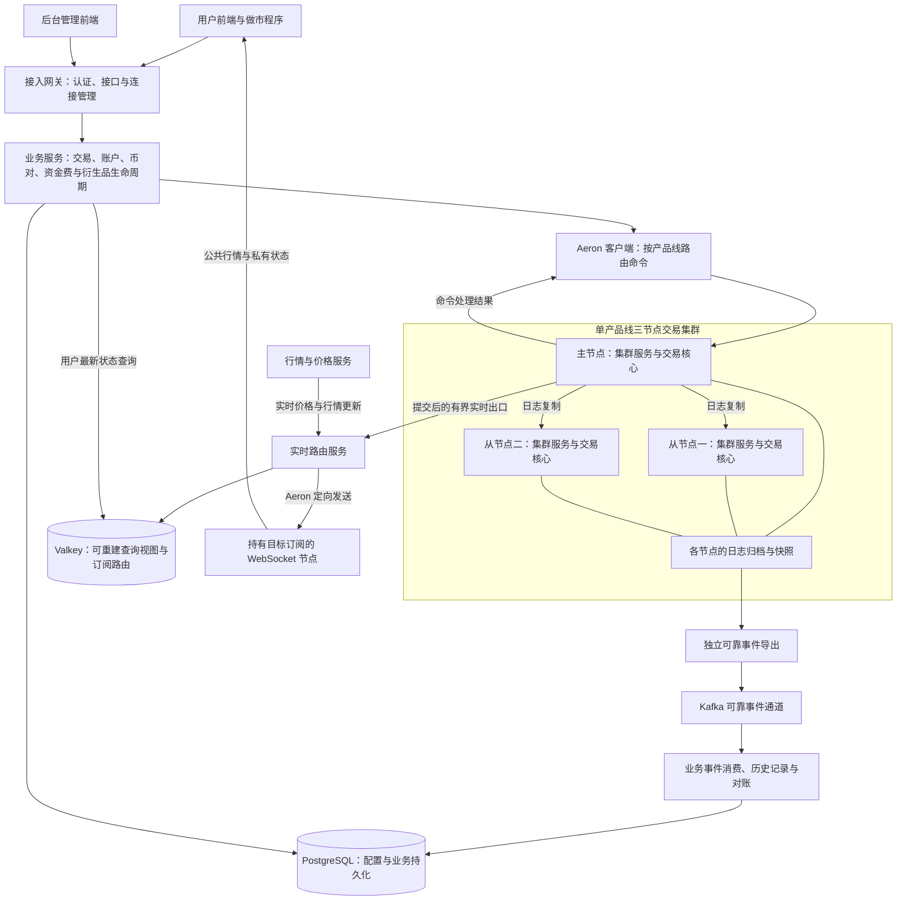
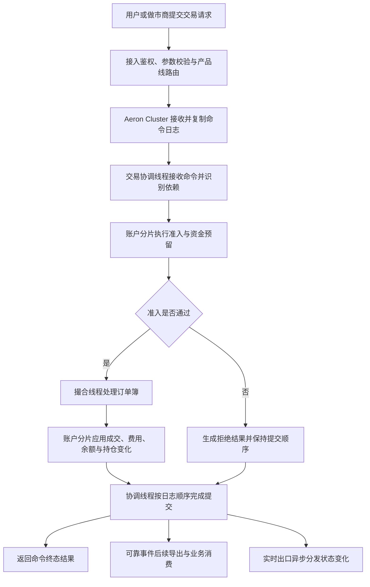
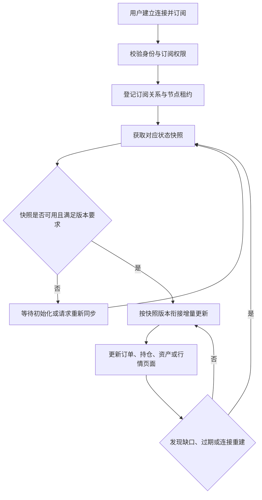

# Surprising 交易系统

## 项目介绍

Surprising 是一个正在开发和验证中的多产品线交易系统。本仓库承载交易后端，围绕交易撮合、账户结算、风险处理、行情分发和运营管理组织服务，并通过 Aeron Cluster 构建交易核心的高可用运行环境。

项目面向普通用户、做市商和运营人员。建设目标是在资金与持仓正确、业务可恢复的前提下，提高持续交易处理能力，并逐步完善前后端、监控、安全及部署体系。已有功能仍需持续联调和验收，后续计划不代表已经具备完整的生产运营能力。

### 产品线

| 产品线 | 业务范围 |
| --- | --- |
| 现货 | 下单、撤单、撮合、资产冻结与解冻、成交结算 |
| U 本位永续 | 保证金、持仓、资金费、风险检查与强平 |
| 币本位永续 | 反向合约计价、保证金、资金费与风险处理 |
| U 本位交割 | 保证金交易、到期交割与持仓结算 |
| 币本位交割 | 反向合约交易、到期交割与持仓结算 |
| 期权 | 权利金、持仓风险、到期行权与失效处理 |

六条产品线通过统一的产品线标识进行路由，分别隔离交易状态、账户语义、行情订阅和事件。各产品线使用独立的逻辑交易集群，不能混用币对、资金模型或结算规则。

## 总体架构

系统分为接入与业务服务、交易核心、可靠事件处理、实时推送与查询四个部分。图中的交易集群代表一条产品线，其他产品线按相同边界独立部署。

### 关键边界

- **交易核心负责裁决。** 撮合结果、余额、冻结、持仓和风险状态由核心按确定性规则推进，数据库或缓存中的查询视图不能代替核心裁决。
- **三个节点均运行交易核心。** 集群以复制日志驱动执行，通过日志与快照恢复业务状态；从节点承担故障切换与恢复职责。
- **交易与外围处理分离。** 可靠事件导出、Kafka 消费、Valkey 访问及 WebSocket 推送通过外围组件处理，避免把这些同步网络操作放入交易执行线程。
- **可靠事件与实时推送用途不同。** 需要持久化、重放和对账的事件保留可靠通道；实时展示允许跳过过时更新，但必须能识别数据缺口并重新建立快照基线。
- **查询视图可以重建。** 普通用户最新状态查询使用 Valkey 读模型；核心一致性查询、管理查询和交易前置校验仍有各自的核心路径，不能一概视为无交易开销。

## 交易处理流程

交易执行由协调线程、账户分片线程和撮合线程协作完成。命令先进入协调线程，再执行账户准入、撮合与结算，最后按集群日志顺序提交。

独立命令可以在有界窗口内持续推进；存在资金、订单或生命周期依赖的操作仍需遵守执行顺序。快照、恢复和一致性边界也需要保证已提交状态完整。吞吐优化必须建立在这些约束之上。

下单命令处理完成不等于订单已经全部成交。未成交挂单仍有后续成交、撤单或失效等状态变化，需要结合查询和推送展示完整生命周期。

## 实时推送与最新状态查询

公共行情按产品线、币对和频道组织订阅；私有数据按已认证用户路由。路由服务根据订阅关系选择目标 WebSocket 节点，不要求所有节点接收全部用户数据。

Valkey 保存可重建的最新状态，不能替代永久订单和成交历史。终态订单、已执行触发单及归零持仓等需要按各自生命周期更新或移出活动视图。缓存不可用或状态尚未同步时，应明确返回不可用状态，避免通过自动回查核心放大交易压力。

## 仓库模块

| 模块 | 主要职责 |
| --- | --- |
| [surprising-parent](surprising-parent/) | 构建、依赖与公共插件配置 |
| [surprising-product-api](surprising-product-api/) | 产品线定义与共享产品契约 |
| [surprising-aeron-core](surprising-aeron-core/) | 核心协议、集群服务、客户端、运维工具及独立测试压测模块 |
| [surprising-instrument](surprising-instrument/) | 币对与合约配置、交易状态管理 |
| [surprising-trading](surprising-trading/) | 订单、触发单与交易业务接入 |
| [surprising-account](surprising-account/) | 账户接口、资产与持仓查询及相关事件处理 |
| [surprising-market-data](surprising-market-data/) | 盘口、成交行情与市场数据服务 |
| [surprising-price](surprising-price/) | 指数价格、标记价格及价格分发 |
| [surprising-funding](surprising-funding/) | 永续资金费业务 |
| [surprising-derivatives-lifecycle](surprising-derivatives-lifecycle/) | 衍生品风险、强平、保险及交割行权相关业务 |
| [surprising-realtime](surprising-realtime/) | 实时路由、订阅目录、状态快照与 Valkey 查询视图 |
| [surprising-gateway](surprising-gateway/) | 接入、认证、管理接口与 WebSocket 连接 |
| [surprising-maker](surprising-maker/) | 做市程序与相关业务支持 |

用户前端项目为 `surprising-ex-web`、`surprising-client`，后台管理前端项目为 `surprising-admin-web`，与本仓库分别维护。

主要技术组成包括 Java 25、Maven、Spring Boot、Aeron Cluster、Aeron Transport、exchange-core、Kafka、PostgreSQL、Valkey 和 WebSocket。具体依赖与构建约束以仓库配置为准。

## 后续计划

以下工作按正确性、可恢复性、可观测性和运营需求持续推进，完成标准以对应功能、测试和部署验收为准。

### 提升交易吞吐

- 持续定位协调线程、账户分片、撮合、日志复制和网络的实际瓶颈，区分有效业务计算、空轮询与依赖等待。
- 减少不必要的串行处理、全链路排空、跨线程协调、临时对象分配和重复计算。
- 在保持资金依赖、日志顺序和确定性提交的前提下，完善多命令流水线与批量处理。
- 在真实三节点环境中验证持续下单、做市、触发扫描、风控、平仓和强平混合场景，统一吞吐、延迟、积压及资金正确性口径。

### 完善微服务架构

- 梳理服务职责与数据所有权，明确核心、业务服务、可靠事件、查询和推送之间的边界。
- 完善接口契约、幂等、超时、背压、故障隔离与事件重放，减少隐式耦合。
- 完善服务健康检查、配置管理、滚动升级和兼容性验证，持续检查六产品线隔离。
- 完善实时路由服务的高可用、分区所有权、节点租约与故障后的状态重建。

### 完善监控与故障诊断

- 建立集群角色、复制进度、归档、快照、切换和恢复监控。
- 监控各执行线程的有效负载、队列积压、吞吐、拒绝、超时及尾延迟。
- 补齐堆内外内存、垃圾回收、锁竞争、线程调度、磁盘和网络监控。
- 监控可靠事件导出延迟、消费积压、读模型就绪状态、推送丢弃及订阅租约。
- 完善统一日志、请求关联、告警分级、运行看板与故障处置流程。

### 完成前后端整合

- 联调两个用户前端与六条产品线的交易、行情、订单、持仓和资产接口。
- 统一公共及私有订阅协议，完善快照与增量衔接、断线重连、缺口恢复和错误提示。
- 完善盘口聚合精度、成交、K 线、标记价格与资产盈亏的联动展示。
- 验证普通用户与做市商在多设备、弱网和连续交易下的状态一致性。

### 完善后台管理

- 完善币对配置、暂停与恢复交易、币对下架和系统维护流程。
- 完善运营撤单、批量撤单、可选方式平仓及操作进度、失败结果与核对能力。
- 完善账户、风险、强平、保险、资金费和到期结算的运营查询与处置。
- 完善角色权限、敏感操作复核和审计记录，记录操作人、操作对象、修改内容及执行结果。

### 完善部署与运维文档

- 整理本地开发、测试环境、预生产及生产环境的构建和部署说明。
- 明确三节点拓扑、网络端口、存储布局、资源分配与进程启动参数。
- 补齐配置与密钥管理、数据库初始化、依赖服务、前后端部署及环境检查。
- 编写备份恢复、扩缩容、升级回滚、维护停机和灾难恢复操作手册，并通过实际演练验证。

### 补齐测试体系

- 完善单元、协议、集成和端到端测试，覆盖六产品线的完整交易生命周期。
- 持续验证资金守恒、冻结与解冻、费用、持仓、风险、强平、ADL、资金费、交割和行权。
- 覆盖主节点故障、从节点故障、网络分区、进程强制退出、日志回放、快照恢复和重复命令。
- 补齐缓存与消息服务故障、推送缺口、客户端重连和查询恢复测试。
- 建立真实三节点容量、并发、尾延迟与长稳测试，检查内存增长、资源泄漏和最终积压。
- 完善自动化回归与发布检查，使测试结果和原始证据可追溯。

### 持续安全加固

- 完善用户、管理员及服务间身份认证，检查接口和私有订阅的越权风险。
- 完善接口签名、重放防护、限流、连接配额及异常流量处理。
- 加固密钥管理、传输加密、数据库与缓存权限、内部网络访问控制。
- 持续进行依赖漏洞扫描、输入校验、模糊测试、安全审计与渗透测试。
- 完善敏感数据脱敏、审计留存、备份保护与安全事件响应。

## 开发与验证原则

正确性与资金安全优先于性能数字。功能变更需要覆盖对应产品线、资金状态和恢复路径；性能结论需要说明实际负载、环境、统计口径与验证范围。

本地用于构建、功能检查和正确性验证；交易性能测试使用三个独立节点组成的真实 Aeron Cluster。历史测试结果不能直接当作当前生产容量承诺。
