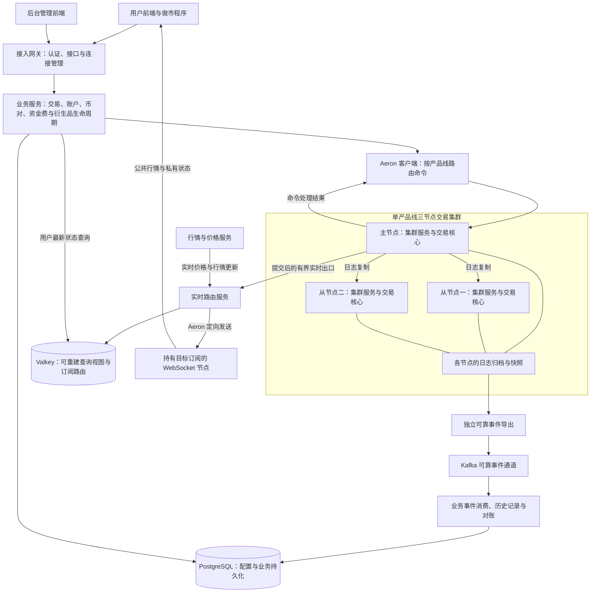

# Surprising 交易系统

## 项目介绍

Surprising 是一个正在开发和验证中的多产品线交易系统。本仓库承载交易后端，围绕交易撮合、账户结算、风险处理、行情分发和运营管理组织服务，并通过 Aeron Cluster 构建交易核心的高可用运行环境。

项目面向普通用户、做市商和运营人员。建设目标是在资金与持仓正确、业务可恢复的前提下，提高持续交易处理能力，并逐步完善前后端、监控、安全及部署体系。已有功能仍需持续联调和验收，后续计划不代表已经具备完整的生产运营能力。

### 产品线

| 产品线 | 业务范围 |
| --- | --- |
| 现货 | 下单、撤单、撮合、资产冻结与解冻、成交结算 |
| U 本位永续 | 保证金、持仓、资金费、风险检查与强平 |
| 币本位永续 | 反向合约计价、保证金、资金费与风险处理 |
| U 本位交割 | 保证金交易、到期交割与持仓结算 |
| 币本位交割 | 反向合约交易、到期交割与持仓结算 |
| 期权 | 权利金、持仓风险、到期行权与失效处理 |

六条产品线通过统一的产品线标识进行路由，分别隔离交易状态、账户语义、行情订阅和事件。各产品线使用独立的逻辑交易集群，不能混用币对、资金模型或结算规则。

## 总体架构

系统分为接入与业务服务、交易核心、可靠事件处理、实时推送与查询四个部分。图中的交易集群代表一条产品线，其他产品线按相同边界独立部署。

### 关键边界

- **交易核心负责裁决。** 撮合结果、余额、冻结、持仓和风险状态由核心按确定性规则推进，数据库或缓存中的查询视图不能代替核心裁决。
- **三个节点均运行交易核心。** 集群以复制日志驱动执行，通过日志与快照恢复业务状态；从节点承担故障切换与恢复职责。
- **交易与外围处理分离。** 可靠事件导出、Kafka 消费、Valkey 访问及 WebSocket 推送通过外围组件处理，避免把这些同步网络操作放入交易执行线程。
- **可靠事件与实时推送用途不同。** 需要持久化、重放和对账的事件保留可靠通道；实时展示允许跳过过时更新，但必须能识别数据缺口并重新建立快照基线。
- **查询视图可以重建。** 普通用户最新状态查询使用 Valkey 读模型；核心一致性查询、管理查询和交易前置校验仍有各自的核心路径，不能一概视为无交易开销。

## 仓库模块

| 模块 | 主要职责 |
| --- | --- |
| [surprising-parent](surprising-parent/) | 构建、依赖与公共插件配置 |
| [surprising-product-api](surprising-product-api/) | 产品线定义与共享产品契约 |
| [surprising-aeron-core](surprising-aeron-core/) | 核心协议、集群服务、客户端、运维工具及独立测试压测模块 |
| [surprising-instrument](surprising-instrument/) | 币对与合约配置、交易状态管理 |
| [surprising-trading](surprising-trading/) | 订单、触发单与交易业务接入 |
| [surprising-account](surprising-account/) | 账户接口、资产与持仓查询及相关事件处理 |
| [surprising-market-data](surprising-market-data/) | 盘口、成交行情与市场数据服务 |
| [surprising-price](surprising-price/) | 指数价格、标记价格及价格分发 |
| [surprising-funding](surprising-funding/) | 永续资金费业务 |
| [surprising-derivatives-lifecycle](surprising-derivatives-lifecycle/) | 衍生品风险、强平、保险及交割行权相关业务 |
| [surprising-realtime](surprising-realtime/) | 实时路由、订阅目录、状态快照与 Valkey 查询视图 |
| [surprising-gateway](surprising-gateway/) | 接入、认证、管理接口与 WebSocket 连接 |
| [surprising-maker](surprising-maker/) | 做市程序与相关业务支持 |

用户前端项目为 `surprising-ex-web`、`surprising-client`，后台管理前端项目为 `surprising-admin-web`，与本仓库分别维护。

主要技术组成包括 Java 25、Maven、Spring Boot、Aeron Cluster、Aeron Transport、exchange-core、Kafka、PostgreSQL、Valkey 和 WebSocket。具体依赖与构建约束以仓库配置为准。

## 开发与验证原则

正确性与资金安全优先于性能数字。功能变更需要覆盖对应产品线、资金状态和恢复路径；性能结论需要说明实际负载、环境、统计口径与验证范围。

本地用于构建、功能检查和真实单成员 Aeron Cluster 验证，保留网络、Archive 日志及交易 Core；常规性能场景统一128币对和ZGC。历史测试结果不能直接当作当前生产容量承诺。

