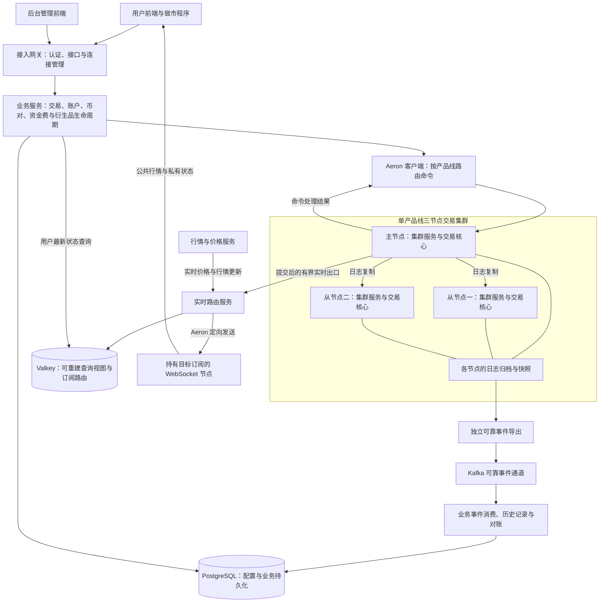

# Surprising 交易系统

## Owner 提交与响应边界

生产入口统一为 `AeronTradingClusterService → TradingOwnerLoop → TradingCoreOwner`。
Owner 通过必填的响应出口交接已提交结果，`ClusterServiceEgress` 在集群线程编码和处理有界背压；
Owner 不再维护兼容的网络发送、编码缓冲和响应重试队列。回调模拟仅位于测试目录的
`TradingOwnerTestSupport`，局部批量基准直接调用实际 Owner，并提供显式的结果消费出口。

`CommitPublication` 保留逐命令索引更新、延迟发布及失败处理边界；`RuntimeCommitJournal`
只维护权威发布序号和生命周期校验，不再提供只有深度计数的 downstream publication batch。
撮合和账户 Lane 的完成条件、资金结算、终态去重及快照恢复顺序不变。

## 项目介绍

Surprising 是一个正在开发和验证中的多产品线交易系统。本仓库承载交易后端，围绕交易撮合、账户结算、风险处理、行情分发和运营管理组织服务，并通过 Aeron Cluster 构建交易核心的高可用运行环境。

项目面向普通用户、做市商和运营人员。建设目标是在资金与持仓正确、业务可恢复的前提下，提高持续交易处理能力，并逐步完善前后端、监控、安全及部署体系。已有功能仍需持续联调和验收，后续计划不代表已经具备完整的生产运营能力。

### 产品线

| 产品线 | 业务范围 |
| --- | --- |
| 现货 | 下单、撤单、撮合、资产冻结与解冻、成交结算 |
| U 本位永续 | 保证金、持仓、资金费、风险检查与强平 |
| 币本位永续 | 反向合约计价、保证金、资金费与风险处理 |
| U 本位交割 | 保证金交易、到期交割与持仓结算 |
| 币本位交割 | 反向合约交易、到期交割与持仓结算 |
| 期权 | 权利金、持仓风险、到期行权与失效处理 |

六条产品线通过统一的产品线标识进行路由，分别隔离交易状态、账户语义、行情订阅和事件。各产品线使用独立的逻辑交易集群，不能混用币对、资金模型或结算规则。

## 总体架构

身份、订单、账户、合约已合并为 `surprising-gateway` 一个业务应用，默认产品线为
`LINEAR_PERPETUAL`。三套 provider 的业务源码及测试迁入该模块，独立启动入口已删除；
`surprising-trading-api`、`surprising-account-api`、`surprising-instrument-api` 保留为共享契约。
四个业务包通过本地方法调用协作，Aeron Core 继续使用独立 JVM 和集群日志。
启动、鉴权边界及验证记录见 [业务应用合并说明](docs/business-application-merge.md)。

交易核心的 Owner 流水线位于 `surprising-aeron-core/surprising-aeron-service`：
`TradingCoreOwner` 每轮按需收集 Matcher/Lane 完成结果，再按 FIFO 连续退休 ready 命令，
不等待凑批；新准入或未 ready 的队首会重新推进异步工作。每条命令独立保留日志时间、位置、
资金校验、发布与响应边界。`OwnerCommandPipelineState` 直接引用窗口队首及实际依赖末项，
不复制命令序号、不维护单元素“批量前缀”；依赖项退休时清除引用，再复用槽位。

Lane 终态合并时，`LanePublication.publish` 对路由删除 ID 只在删除集合遍历中应用一次，
包括没有 after-image 的订单/冻结删除；变更 ID 的首次出现顺序不变。
`TradingRuntimeState.LaneCommitDelta` 的终态收据只按 count 读取，复用时保留原语数组、重置 count，
清空客户号和订单对象引用；终态保留索引的幂等查找仍保留。

诊断时通过 `core.settlementLatencyDiagnostics=true` 和 `owner-commit-profile.jfc` 启用稀疏 JFR：
`CoreMatchingPhaseMetrics` 区分提交尝试（等待/终态）、事实发布、终态记账、实时发布和回复退休；
事实发布/记账包含在提交尝试内，不可重复相加。`OwnerTurn` 每 64 个非空 FIFO 轮次采样退休数、
队首等待和预算耗尽，不代表全部轮次精确计数。Lane 完成到 Owner 提交的延迟包含排队，不能当作尾部执行时间。
`OwnerSettlementMergeEvent` 按 sequence 哈希抽样 1/64，只在 Owner 当前调用栈内保存计时：
`collection` 覆盖 `collectMatcherSettlement`（含淘汰和回收），`lane` 覆盖单 Lane 终态合并，
拆分发布账户/订单/冻结/持仓/删除路由、终态索引和变更索引。collection 包含 lane，
publication 包含各发布表，不能重复相加；按 sequence 与 SettlementLatency 关联业务类型，
未关联样本单列，未覆盖路径不填零。默认关闭诊断，不新增业务状态、队列或线程交接。
同一事件还提供两组互斥的1/2048样本：订单get/equals/put与删除计时，以及实际删除表的
只读探测链观察（搜索/扫描各限128槽，超限计数）。后者反射读取Agrona数组、模拟移动数，
不修改表，也不与计时样本混算，避免预热缓存干扰；它只是诊断，不是新容器或业务索引。
“相等after-image”不能直接解释为“业务未变”：还需排除准入阶段可变引用共享，
并保留提交元数据、命令完成、资金核对和恢复边界。相关验证见PERFORMANCE_VALIDATION.md。

普通和批量准入分别在 `PlaceAdmissionEvent` / `PlaceBatchAdmissionEvent` 内冻结订单、冻结收据，
Lane 后续原地成交不能修改 Owner 已接收的版本。`MatcherSettlementEvent` 交给实时输出的准入订单
也必须是不可变版本。`completeMatcherPendingReservations` 保留完成计数和变更 ID，已有变更不重复覆盖，
未变化时复用不可变准入版本；完整字段比较保留提交时间和位置语义，不能仅比较 revision。
暂不取消 Owner 临时订单发布：非直连结算取单及实时成交事件仍依赖它，直接删除已被六产品线回归证伪。

普通单的不可变准入订单通过现有 `AdmissionReceiptRing` 交给 Matcher，再存入结算事件的现有订单槽，
不在结算 Lane 再复制一次。收据槽发布沿用 release/acquire 屏障，消费后先清空引用再允许复用，
因此 Owner 可以独立回收准入事件。终态记录与 Lane 清理同遍执行；Owner 删除持仓时在发布遍历内
先捕获旧持仓再删除，保留实时推送失败处理。已有订单变更不额外查 Lane 订单表，Map drain 不重复清零。

Matcher 的普通、撤单、改单和批量直达路径把 exchange-core 生成的不可变 `MatcherResult` 直接写入
既有 `MatcherSettlementEvent`，Lane 从该事件消费成交事实，不再为跨线程交接复制一层撮合结果。
撮合恢复游标只保存每个 shard 的严格递增 sequence；已删除热路径 rolling hash/prefix digest，避免维护
第二套非业务权威状态。快照整体仍保留 CRC32C 传输校验，资金、订单终态、FIFO 和 shard 顺序校验不变。
对应 matcher 快照格式为 v8，命令结果协议为 v5，Core 响应协议为 v6，分片快照格式为 v26；
项目未上线，不兼容读取旧格式。

生产快照不再受旧的64MiB固定上限约束。默认安全上限为1GiB，可按单产品线最大订单、持仓和账户人口
通过JVM参数`-Dsurprising.aeron.snapshot.max-bytes=<bytes>`调整，合法范围为64MiB至Java单数组上限；所有集群成员
必须使用同一值。Aeron写入直接发布分段快照，恢复直接把fragment送入分段校验器，不再额外合并一份完整快照；
CRC32C、分段长度、总长度和恢复完整性校验仍保留。容量规划应至少预留一次快照分段状态及恢复对象空间，不能只按文件大小配置堆。
大人口快照的捕获、发布和恢复超时统一由`-Dsurprising.aeron.snapshot-timeout-seconds=<seconds>`配置，默认300秒。

系统分为接入与业务服务、交易核心、可靠事件处理、实时推送与查询四个部分。图中的交易集群代表一条产品线，其他产品线按相同边界独立部署。

## 仓库模块

| 模块 | 主要职责 |
| --- | --- |
| [surprising-parent](surprising-parent/) | 构建、依赖与公共插件配置 |
| [surprising-product-api](surprising-product-api/) | 产品线定义与共享产品契约 |
| [surprising-aeron-core](surprising-aeron-core/) | 核心协议、集群服务、客户端、运维工具及独立测试压测模块 |
| [surprising-instrument](surprising-instrument/) | 合约共享 API；业务实现位于 gateway 的 instrument 包 |
| [surprising-trading](surprising-trading/) | 订单和触发单共享 API；业务实现位于 gateway 的 trading 包 |
| [surprising-account](surprising-account/) | 账户共享 API；业务实现位于 gateway 的 account 包 |
| [surprising-market-data](surprising-market-data/) | K 线 API 契约；盘口实现已入 gateway，K 线实现已入 realtime |
| [surprising-price](surprising-price/) | 指数价格、标记价格及价格分发 |
| [surprising-funding](surprising-funding/) | 资金费 API 契约；运行实现已合入 derivatives-lifecycle |
| [surprising-derivatives-lifecycle](surprising-derivatives-lifecycle/) | 衍生品风险、强平、保险及交割行权相关业务 |
| [surprising-realtime](surprising-realtime/) | K 线聚合/查询、实时路由、状态快照与 Valkey 查询视图 |
| [surprising-gateway](surprising-gateway/) | 统一身份、订单、账户、合约业务应用，以及 HTTP / WebSocket 接入 |
| [surprising-maker](surprising-maker/) | 做市程序与相关业务支持 |

测试服务器单节点永续部署见 [deployment/test-single-node/README.md](deployment/test-single-node/README.md)。该入口只启用 `LINEAR_PERPETUAL`，不启动 wallet；生产高可用仍需三节点切主和资金链路验收。

用户前端项目为 `surprising-ex-web`、`surprising-client`，后台管理前端项目为 `surprising-admin-web`，与本仓库分别维护。

当前 U 永续单节点完整部署：gateway、Core、price、realtime（含 K 线与可靠成交导出）、
derivatives-lifecycle（含 funding）、maker，共 6 个 Java 进程。应用侧共享 MediaDriver 内嵌在 gateway 中。
成交导出由 `TRADE_EXPORT_ENABLED` 控制，配置与迁移要求见 [行情应用说明](surprising-realtime/README.md)。
