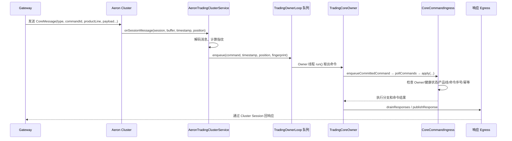
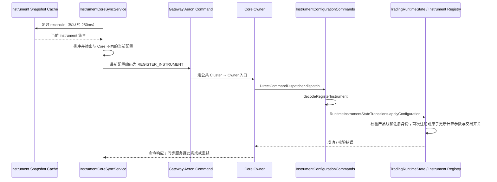
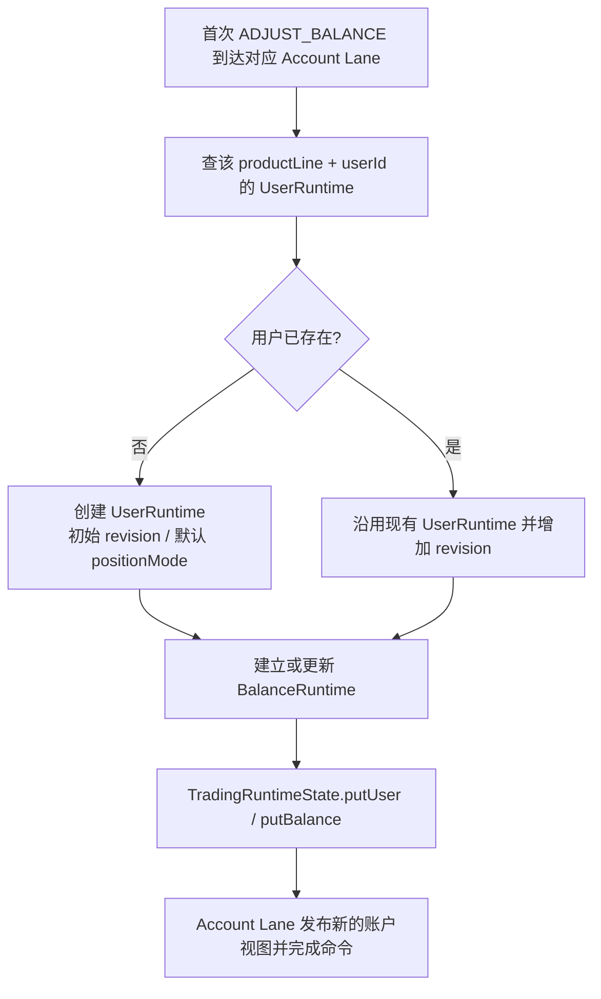
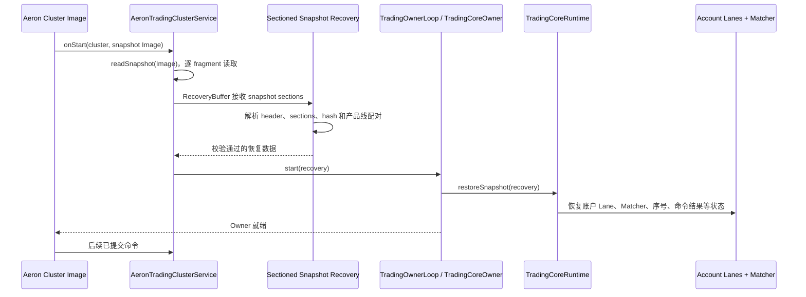
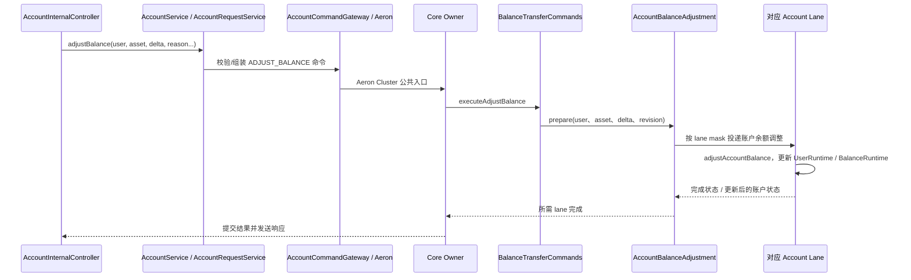
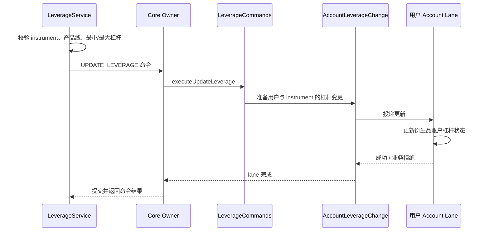
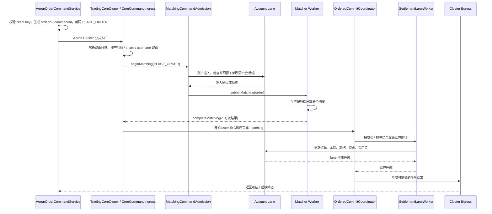

# Aeron Service 启动与命令流转图

这份文档从“服务启动后，一条命令怎么走到业务状态里”出发，按源码入口串起 instrument 注册、用户运行态建立、快照恢复、余额调整、杠杆调整和下单。

> 阅读范围：重点是 `surprising-aeron-service` 的 Owner / Account Lane 链路，以及 Gateway 如何把业务请求变成 Core 命令。方法名链接可以直接跳到源码。

## 先看整体：命令从 Gateway 到状态落地

```mermaid
flowchart LR
    A[Gateway 业务入口\n校验并编码 Core 命令] --> B[Aeron Cluster\n复制并按序记录命令]
    B --> C[AeronTradingClusterService\nonSessionMessage]
    C --> D[CoreMessageFlyweightDecoder\n解码消息并计算指纹]
    D --> E[TradingOwnerLoop\n放入 Owner 有界队列]
    E --> F[TradingCoreOwner\n按 Cluster 顺序取命令]
    F --> G[CoreCommandIngress.apply\n检查状态、产品线、幂等和序号]
    G --> H{命令类型}
    H -->|注册 instrument 等直接命令| I[DirectCommandDispatcher\n调用具体 Commands]
    H -->|下单、撤单等撮合命令| J[MatchingCommandAdmission\n账户准入与撮合流程]
    I --> K[更新 Runtime / Account Lane 状态]
    J --> L[Matcher 计算成交结果]
    L --> M[Settlement Lane\n应用成交、资金、持仓]
    K --> N[Owner 提交命令结果]
    M --> N
    N --> O[TradingOwnerLoop / ClusterServiceEgress\n向客户端会话发响应]
```

### 每层实际负责什么

| 所在位置 | 主要工作 | 关键入口 |
| --- | --- | --- |
| Gateway | 校验业务请求、选择产品线、组装命令 ID 和 payload | 各业务 Gateway / Service |
| Aeron Cluster | 复制命令并给命令确定顺序；不是余额或订单状态的业务所有者 | Cluster 回调 |
| Cluster Service | 收到已提交的消息，解码、排队、收集并发回响应 | [`AeronTradingClusterService.onSessionMessage`](../surprising-aeron-core/surprising-aeron-service/src/main/java/com/surprising/aeron/service/cluster/AeronTradingClusterService.java#L60) |
| Owner | 按 Cluster 顺序推进命令、做幂等和准入编排、决定何时提交结果 | [`TradingOwnerLoop.run`](../surprising-aeron-core/surprising-aeron-service/src/main/java/com/surprising/aeron/service/cluster/TradingOwnerLoop.java#L173)、[`TradingCoreOwner.pollCommands`](../surprising-aeron-core/surprising-aeron-service/src/main/java/com/surprising/aeron/service/orchestration/TradingCoreOwner.java#L581) |
| Account Lane | 串行拥有并修改账户余额、用户及其账户运行态；异步命令要等 Lane 完成 | `AccountLaneState`、`TradingRuntimeState` |
| Matcher | 计算撮合结果；结果再交给 Owner / Settlement 路径按顺序落账 | `TradingCoreRuntime`、`OrderedCommitCoordinator` |
| Settlement Lane | 把成交结果应用到账户余额、订单、持仓和费用等状态 | `SettlementLaneWorker` |

Owner 是一条核心编排线程。Cluster Service 收消息后把命令交给 Owner；账户状态由对应 Account Lane 串行修改；撮合计算可以交给 Matcher worker。**响应不是“消息一解码就成功”**：直接命令要等执行/提交，撮合命令要等所需的账户准入、撮合及结算阶段完成，之后才形成最终响应。部分下单流程可以先返回处理中状态，最终结果随后到达。

## 公共入口：一条 Core 命令如何被接收

源码阅读顺序：

1. [`AeronTradingClusterService.onStart`](../surprising-aeron-core/surprising-aeron-service/src/main/java/com/surprising/aeron/service/cluster/AeronTradingClusterService.java#L53)：启动 Egress 和 Owner；若 Cluster 提供快照，先读取快照，再启动恢复后的 Owner。
2. [`AeronTradingClusterService.onSessionMessage`](../surprising-aeron-core/surprising-aeron-service/src/main/java/com/surprising/aeron/service/cluster/AeronTradingClusterService.java#L60)：Cluster 的消息回调入口；解码并把已提交命令及日志位置交给 Owner。
3. [`TradingOwnerLoop.start`](../surprising-aeron-core/surprising-aeron-service/src/main/java/com/surprising/aeron/service/cluster/TradingOwnerLoop.java#L67) / [`run`](../surprising-aeron-core/surprising-aeron-service/src/main/java/com/surprising/aeron/service/cluster/TradingOwnerLoop.java#L173)：建立专用 Owner 线程，按队列顺序推进命令。
4. [`TradingCoreOwner.enqueueCommittedCommand`](../surprising-aeron-core/surprising-aeron-service/src/main/java/com/surprising/aeron/service/orchestration/TradingCoreOwner.java#L92) / [`pollCommands`](../surprising-aeron-core/surprising-aeron-service/src/main/java/com/surprising/aeron/service/orchestration/TradingCoreOwner.java#L581)：把 Cluster 的 timestamp / position 带入核心流程。
5. [`CoreCommandIngress.apply`](../surprising-aeron-core/surprising-aeron-service/src/main/java/com/surprising/aeron/service/command/CoreCommandIngress.java#L36)：公共入口校验、读取隔离和分流；再进入 `applyCommandIngress` 做命令级幂等、来源序号检查和 direct / matching 分派。
6. 命令结束后，Owner 通过 [`TradingOwnerLoop.drainResponses`](../surprising-aeron-core/surprising-aeron-service/src/main/java/com/surprising/aeron/service/cluster/TradingOwnerLoop.java#L99) 收集响应，并经 [`ClusterServiceEgress.publishResponse`](../surprising-aeron-core/surprising-aeron-service/src/main/java/com/surprising/aeron/service/cluster/ClusterServiceEgress.java#L100) 发回对应 Session。

常见拒绝点也在这条公共路径上：消息格式错误、非 Owner / 状态不健康、产品线不匹配、重复命令 ID 的内容指纹不一致、来源序号过期，都会在继续修改业务状态前拒绝或返回已有结果。具体业务校验还会在每种命令的 handler 内执行。

## 服务启动后：instrument 是怎么注册的

方法链：

`InstrumentCoreSyncService.reconcile()` → `applyConfiguration()` → 发送 `REGISTER_INSTRUMENT` → 公共入口 → [`DirectCommandDispatcher.dispatch`](../surprising-aeron-core/surprising-aeron-service/src/main/java/com/surprising/aeron/service/command/DirectCommandDispatcher.java#L62) → [`InstrumentConfigurationCommands.executeRegisterInstrument`](../surprising-aeron-core/surprising-aeron-service/src/main/java/com/surprising/aeron/service/command/instrument/InstrumentConfigurationCommands.java#L16) → `TradingCommandCodec.decodeRegisterInstrument()` → [`RuntimeInstrumentStateTransitions.applyConfiguration`](../surprising-aeron-core/surprising-aeron-service/src/main/java/com/surprising/aeron/service/state/RuntimeInstrumentStateTransitions.java#L14) → 首次配置加入 registry，或更新同一个 `CoreInstrument` 引用中的计算参数和交易准入开关。

Gateway 的定时同步入口在 [`InstrumentCoreSyncService.reconcile`](../surprising-gateway/src/main/java/com/surprising/trading/order/service/InstrumentCoreSyncService.java#L35)，首次注册和后续更新都进入 `applyConfiguration`。这里等待 instrument cache 就绪，再逐项同步当前配置；失败后退避重试，未知结果复用命令 ID。订单状态、订单类型/TIF、市价单、Post Only 和 Reduce Only 开关由 Gateway 快照做前置校验，并在 Core 的订单准入入口再次校验；撤单不经过这些新单开关。

**初始化时序限制：** Core 在第一个非 `REGISTER_INSTRUMENT` 命令到达时封存 instrument registry。启动后可以用同一命令更新已有 symbol 的计算配置；新增 symbol 仍受封存约束并会被拒绝。注册身份字段不可变。

## 用户初始化：没有单独的“创建用户”Core 命令

`CoreMessageType` 里有 `ADJUST_BALANCE`、下单等命令，但没有 `CREATE_USER` / `REGISTER_USER`。用户在认证或账户数据库中的注册，与 Aeron Core 运行时里建立用户状态，是两回事。

一种常见的运行态建立方式是**首次余额调整**：

具体代码在 [`RuntimeAccountStateTransitions.adjustAccountBalance`](../surprising-aeron-core/surprising-aeron-service/src/main/java/com/surprising/aeron/service/state/RuntimeAccountStateTransitions.java#L31)：没有 `UserRuntime` 时构造用户运行态，然后写入用户和余额；已有用户则基于现有状态更新。[`TradingRuntimeState.putUser`](../surprising-aeron-core/surprising-aeron-service/src/main/java/com/surprising/aeron/service/state/TradingRuntimeState.java) 会把用户注册到对应 Account Lane 并更新运行时视图。

这说明“首次余额调整可以建立运行态用户”，**不代表每个用户都必须由余额调整创建**；其他合法账户命令也可能按自己的业务规则物化所需状态。恢复快照则是把已存在的用户运行态恢复回来，不是重新注册业务用户。

## 快照恢复：先恢复状态，再处理后续日志命令

源码顺序：[`AeronTradingClusterService.onStart`](../surprising-aeron-core/surprising-aeron-service/src/main/java/com/surprising/aeron/service/cluster/AeronTradingClusterService.java#L53) → `readSnapshot`（同文件）→ `SectionedCoreSnapshotRecovery.decode` / `SectionedCoreSnapshotParser.parse` → [`SectionedCoreSnapshotValidation`](../surprising-aeron-core/surprising-aeron-service/src/main/java/com/surprising/aeron/service/orchestration/SectionedCoreSnapshotValidation.java) → [`TradingOwnerLoop.start`](../surprising-aeron-core/surprising-aeron-service/src/main/java/com/surprising/aeron/service/cluster/TradingOwnerLoop.java#L67) → [`TradingCoreOwner.restoreSnapshot`](../surprising-aeron-core/surprising-aeron-service/src/main/java/com/surprising/aeron/service/orchestration/TradingCoreOwner.java#L646) → `TradingCoreRuntime.fromSnapshot(...)` → `replaceState(...)`。

快照 section 保存的是继续处理命令所需的运行状态，例如账户 Lane、Matcher、来源序号、命令结果账本、费率配置和转账运行态。恢复会校验版本 / header、section 完整性、hash、产品线和账户 Lane 配对等；校验失败时不能把不完整或互相矛盾的状态当作已恢复状态继续运行。

**和普通命令的区别：** 快照恢复发生在 Owner 启动阶段，不是某个用户发来的 Core 命令。恢复完成后，Cluster 后续日志中的命令才进入前面的公共入口。快照写入方向由 `onTakeSnapshot` 请求 Owner 捕获各 section，再经 snapshot writer / codec 编码。

## 调整用户资金：从账户 API 到 Account Lane

Gateway 侧从 [`AccountInternalController.adjustBalance`](../surprising-gateway/src/main/java/com/surprising/account/provider/controller/AccountInternalController.java#L38) → `AccountService.adjustBalance` → `AccountRequestService.adjustBalance` → `AccountCommandGateway.adjustBalance` 进入 Aeron 命令。

Core 侧是 [`BalanceTransferCommands.executeAdjustBalance`](../surprising-aeron-core/surprising-aeron-service/src/main/java/com/surprising/aeron/service/command/BalanceTransferCommands.java#L22) → `adjustBalance`。Owner 异步运行时会准备 `AccountBalanceAdjustment`，根据用户所在 Lane 投递工作；[`AccountBalanceAdjustment.apply`](../surprising-aeron-core/surprising-aeron-service/src/main/java/com/surprising/aeron/service/command/AccountBalanceAdjustment.java#L49) 最终调用 `RuntimeAccountStateTransitions.adjustAccountBalance`。其 `poll` 等待被投递的 Lane 完成后，Owner 才继续命令提交和响应。

在 Lane 内，状态变化包括用户运行态（如果这是首次物化）、对应资产的余额、版本 / revision 和账户视图。余额调整的正负方向、资产 ID、产品线归属和余额不变量仍由各自校验与状态转换逻辑约束；API 接受请求不等于 Core 已经完成入账。

## 调整杠杆：Gateway 校验后由账户 Lane 更新

Gateway 入口为 [`LeverageService.set`](../surprising-gateway/src/main/java/com/surprising/trading/order/service/LeverageService.java#L34)：检查请求、instrument 规则、产品线和杠杆上下限，再生成 `UPDATE_LEVERAGE` 命令。

Core 入口为 [`LeverageCommands.executeUpdateLeverage`](../surprising-aeron-core/surprising-aeron-service/src/main/java/com/surprising/aeron/service/command/LeverageCommands.java#L17)。Owner 的异步命令路径会通过 `AccountLeverageChange` 将更新交给对应 Account Lane；Lane 完成后才进入结果提交。`DerivativeAccountCommandProcessor.updateLeverage` 是同步处理路径，不能把它误读成生产 Owner 路径的唯一执行点。

## 下单：准入 → 撮合 → 结算 → 终态响应

Gateway 入口是 [`AeronOrderCommandService.placeCommand`](../surprising-gateway/src/main/java/com/surprising/trading/order/service/AeronOrderCommandService.java#L179)：校验 client key，生成稳定的 `orderId` / `commandId`，编码 `PlaceOrderCommand` 并发送。

Core 路由与分支：`TradingCoreOwner.progressCommandsInScope` 准备路由候选 → `CoreCommandIngress.prepareClusterPipelineScope` 按产品线、撮合 shard 和用户 Account Lane 定位 → `CoreCommandIngress.applyCommandIngress` 识别撮合命令 → [`MatchingCommandAdmission.beginMatching`](../surprising-aeron-core/surprising-aeron-service/src/main/java/com/surprising/aeron/service/command/MatchingCommandAdmission.java#L114) → `CoreMatchingFlow.submitMatching` → `TradingCoreRuntime.completeMatching` → `TradingCoreOwner.completeMatching` / `OwnerCommandPipelineState.completeMatching` → `OrderedCommitCoordinator.completeMatchingCommand` → `MatcherSettlementDispatcher` → `SettlementLaneWorker`。

可以把几个状态边界记成：

1. **账户准入**：确认用户、产品和可下单资金状态满足要求；必要时先预留资金。
2. **撮合计算**：Matcher 计算匹配结果，但不直接拥有账户余额状态。
3. **有序提交**：Owner 根据 Cluster 顺序和命令证据推进结果，避免后续命令越过尚未完成的前序命令。
4. **结算落地**：Settlement Lane 把订单结果、成交、余额 / 冻结、持仓、手续费等写入账户权威状态。
5. **响应**：拒绝可以在准入阶段返回；成功的最终结果要满足对应提交 / 结算完成条件。客户端可能先收到处理中状态，再收到后续终态。

具体资金结果仍需按产品线看各自结算逻辑：现货资产冻结和成交扣减、永续资金费 / 持仓及强平规则、交割结算、期权权利金和行权状态并不共用一套业务规则。上图只说明 Aeron 命令编排和状态交接。

## 建议的源码跟读路线

如果想在 IDE 里从一个入口一路单步跟下去，建议按下面顺序：

1. 服务入口：`AeronTradingClusterService.onStart` → `onSessionMessage`。
2. 线程交接：`TradingOwnerLoop.start` → `run` → `TradingCoreOwner.enqueueCommittedCommand` → `pollCommands`。
3. 公共命令分流：`CoreCommandIngress.apply` → `applyCommandIngress` → direct 或 matching。
4. 选一个直接命令：`BalanceTransferCommands.executeAdjustBalance` 或 `LeverageCommands.executeUpdateLeverage`。
5. 选一个撮合命令：`MatchingCommandAdmission.beginMatching` → `CoreMatchingFlow` → `OrderedCommitCoordinator` → `SettlementLaneWorker`。
6. 回包：Owner 响应队列 → `TradingOwnerLoop.drainResponses` → `ClusterServiceEgress.publishResponse`。
7. 独立恢复流程：`AeronTradingClusterService.readSnapshot` → section parser / validation → `TradingCoreOwner.restoreSnapshot`。

### 术语速记

- **Core 命令**：Gateway 发给 Aeron Core 的协议消息，含命令类型、命令 ID、产品线、用户 / 来源序号和业务 payload。
- **Owner**：按 Cluster 日志顺序协调命令和提交结果的专用线程 / 状态所有者入口。
- **Account Lane**：账户状态串行修改边界；一个 Lane 上的账户状态按顺序应用。
- **Matcher**：订单匹配计算所在的执行组件；撮合结果要交回有序提交和结算链路。
- **快照**：恢复 Core 运行状态的 section 集合，不是只存用户列表，也不等于业务数据库的账户注册记录。
