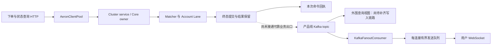

# Surprising Aeron 统一交易核心

## 生命周期正确性修复（2026-09-06，分阶段验证）

- `CoreProbeState` 放行同一结算的合法续页，但保留 symbol 生命周期互斥与参数/游标检查。
  `RuntimeSettlementProcessor` 使用与撮合相同的全局降序订单游标和全局升序用户游标；completion mask 只覆盖本页用户。
- `RuntimePerpetualFundingProcessor` 首批固定 mark price / price sequence，后续页和恢复后不读取新价格计费。
  资金费期间同 symbol 的下单/改单/强平/ADL 等持仓变更受 fence 保护；标记价更新、风险扫描和查询仍可继续。
  客户端遇到 `LIFECYCLE_IN_PROGRESS` 应先完成该 symbol 的有界资金费续页，再重试业务，不得计为成功成交。
  此方案保留了同步生命周期等待，尚不是 owner 全异步优化的验收结果。
- Funding progress 的计价基准进入 materialized/native snapshot 与恢复 hash；`TradingStateSnapshotCodec` 版本为 26，
  不兼容旧版 snapshot，不提供旧格式 fallback。部署需清理/重建未上线环境的旧快照，禁止混用版本。
- `CoreInstrumentState` 拒绝 base/quote 相同的资产配置。`CoreOrderDecisionResolver` 使用 Cluster 时间拒绝到期后新订单；
  `CoreProbeState` 在撮合变更前拒绝未到期的普通交割，不隐含支持紧急提前结算。
- 新增 `LifecyclePaginationBenchmark` / `FundingCutBenchmark` 与恢复回归：4 Lane、1 matcher、256 in-flight 窗口、
  256 交易用户加做市账户；交割 256 个挂单、257 个持仓用户共 32 页，资金费 17 页中插入一次价格更新，逐页恢复。
- 尚未完成：全仓多仓位净额结算、交割欠款/保险不足闭环，以及后续索引、币本位数学和 owner 异步性能优化。
  不得据此宣称资金业务全部验收；交割缺口规则待确认，不能擅自把缺口转成 ADL。真实性能记录见根目录 `PERFORMANCE_VALIDATION.md`。

本目录承载按产品线隔离的 Aeron Cluster 交易核心。每个 `ProductLine` 变体使用相同代码、独立 `clusterId`、
端口空间、Archive 和数据卷；一个逻辑 Core 固定由三个 Member 组成，并管理该变体全部 symbol。

W1/W2 已完成单一可执行盘口改造：`TradingCoreRuntime` 是 Core 单写边界，撮合命令只进入 fork 的
exchange-core 0.5.18-emporia；`TradingCoreState` 不再保存 `CoreBookState` 或任何 FIFO priority map。
matcher 恢复导入 Aeron 配对 snapshot 中全部原生 `ME[0..N)/RE0`，通过 `fromSnapshotOnly` 启动，不逐单回放。

部署基线不按 margin mode 或热点 symbol 分 Core：CROSS 和 ISOLATED 都由同一个 ProductLine Core 裁决；
CROSS 只共享该 Core 内权益，ISOLATED 绑定 position identity。只保留 `coreShardId=default`，当前协议固定
`routeVersion=3`；symbol 只进入同一共享 ExchangeCore 的原生 matcher shard，不启用物理热点 Core 或跨 Core 全仓余额共享。

## 模块

| 模块 | 职责 |
| --- | --- |
| `surprising-aeron-protocol` | schema v4 固定小端二进制 command/envelope、六线 wire code、route v3 和端口布局。 |
| `surprising-aeron-service` | `ClusteredService`、有界幂等状态、Snapshot 和节点启动器。 |
| `surprising-aeron-client` | Leader 自动发现、切换处理和“超时即结果未知”同步客户端。 |
| `surprising-aeron-tools` | Cluster 探针、状态 hash 查询和只读离线 replay 诊断；不得作为生产恢复或 snapshot 来源。 |

## 六产品线规则归属

`ProductTradingRulesRegistry` 以六个固定无状态实例选择规则，`SpotTradingRules`、
`LinearPerpetualTradingRules`、`InversePerpetualTradingRules`、`LinearDeliveryTradingRules`、
`InverseDeliveryTradingRules`、`OptionTradingRules` 各自定义产品身份、订单预留入口及支持的
盈亏、资金费、交割/行权现金流。实现位于 service 模块的 `com.surprising.aeron.service.state` 包，
保留包内可见性；规则类不拥有余额、订单、持仓或线程。

- `RuntimeOrderAdmission` 保留身份、索引及校验次序；金额计算分到 `SpotOrderAdmission`、
  `FuturesOrderAdmission`、`OptionOrderAdmission`。同类的 `reservationUnitsForState` 为 Reducer
  状态值路径，保留其原有手续费预留口径，不混用 Runtime 的分片成交手续费预算。
- `RuntimeSpotMatchProcessor` 负责现货；`RuntimeDerivativeMatchProcessor` 和
  `RuntimeDerivativeFillCalculator` 保留共用成交执行/状态应用，`FuturesFillCalculator`、
  `OptionFillCalculator` 分别承担保证金与期权权利金专属计算。
- `OptionContractMath` 拥有期权保证金、权利金、估值和行权公式；正/反向开仓均价归
  `LinearContractMath`/`InverseContractMath`，共用精确算术归 `CoreArithmetic`。
- `DerivativeAccountCommandProcessor` 拥有持仓模式、杠杆和逐仓保证金命令。
  `RuntimeDerivativeRiskProcessor`/`RuntimeDerivativeLiquidationProcessor` 是衍生品共用执行流程，
  `OptionRiskRules` 负责期权价格要求；资金费仍由 `RuntimePerpetualFundingProcessor` 专门处理。
- `ReducerSpotSettlement`、`ReducerDerivativeSettlement` 分离状态值成交逻辑，
  `ReducerSettlementSupport` 只提供共用状态值资金操作。到期扫描/撤单/进度仍由
  `RuntimeSettlementProcessor` 协调，现金流委托产品规则。

`CoreProbeState` 继续协调幂等、sequence和提交，`TradingRuntimeState`/Account Lane继续唯一持有并修改
权威状态。此整理不增加跨线程任务、状态副本、协议版本或快照格式。新增
`ProductRulesRefactorBenchmark` 覆盖六条线的生产Core准入/成交/撤单及快照恢复，具体证据和验证范围见
根目录 `PERFORMANCE_VALIDATION.md` 的 PV-140/PV-141：定向功能与恢复检查通过，
性能采集受系统换页/CPU限速影响，仅作为诊断，尚未通过性能环境门禁。

## Core 回归测试的当前状态契约

`CoreMatchingStateTest` 从 `CoreCommandResultCodec` 解码本次单笔命令的订单终态；
该响应只包含本次命令相关订单，不包含对手方订单或成交明细。对手方结果结合终态去重记录、
活动订单回收、实际余额/冻结和持仓验证。`CoreOrderedOrderBatchTest` 验证逐项状态与成交明细，
已回收订单的 `Item.order()` 可以为空；未完成命令不应出现在终态命令结果账本中。
异步测试必须等待 Account Lane 结算完成，再验证提交顺序及重复请求返回的数据。

`ACK_EXPORT`、`EXPORT_BATCH_QUERY`、`EXPORT_STATUS_QUERY` 已拒绝为 `INVALID_MESSAGE`，
测试不再通过停用的 Core-Fact exporter 验证成交或资金变动。`RuntimeCommitRecoveryTest`
直接比较恢复前后的命令响应、账户/持仓/财务状态与快照 hash，并检查资金守恒、终态回收、
幂等重放以及损坏快照被原子拒绝。

2026-09-05 按上述契约修复此前 31 个失败实例，仅修改测试及说明，生产代码不变。
HotSpot JDK 25 验证命令：

```bash
mvn -pl surprising-aeron-core/surprising-aeron-service,surprising-aeron-core/surprising-aeron-benchmarks -am test
```

Service 415 项、Benchmark 功能测试 33 项及依赖模块 109 项，共 557 项通过，无失败或跳过。
本次属于测试契约修正，未启动外围服务或重跑 JMH/JFR，不形成新的性能验收结论。

## 交易事件出口与查询隔离审计（2026-09-06）

审计基线：`e2c7ce29`（包含近期资金偿付与生命周期分页修复）。本节为第一步源码审计与后续实施方案，未实现新出口、查询投影或推送协议。
当前会话无可调用的 CodeGraph 工具，依据源码调用、Kafka 生产/消费引用和配置核对；未连接运行环境，
不能据此判断线上 Kafka 是否已有历史消息、PG 是否有旧投影数据，或给出查询延迟与推送吞吐数值。

### 结论与现有链路

**当前缺失的是 Core 已提交变更到外围的可靠出口，不是 WebSocket 发送组件。**
单笔命令回执已经可以让发起方获得本次订单结果，但不包含对手方订单、完整成交与账户更新，
也不能覆盖无 HTTP 请求的触发、资金费、强平、交割和行权。不能拿命令回执代替全量业务事件流。



| 范围 | 当前类和方法 | 源码事实与影响 |
| --- | --- | --- |
| Cluster 回调 | `SurprisingClusteredService.onSessionMessage/processRequest/completeMatching` | 当前日志回调等待 matcher/Account Lane 终态；异步 book 查询也在回调中等待结果，然后回复。不能在这里接用户 fanout 或 Kafka 等待。 |
| 回复 | `SurprisingClusteredService.offerResponse` | 对发起 session 回复；背压会有限重试，超时关闭 session。它不是广播出口，也不是完全无等待的发送。 |
| 单笔提交 | `CoreProbeState.completeMatching` 及 `completeDispatchedMatcherSettlement/completeDispatchedCancel` | 结算、资金校验、推进提交序号、保留命令结果；事件设计要覆盖实际分派分支，不能只挂到一个通用方法。 |
| 批量提交 | `CoreProbeState.applyCompletedOrderBatchItem/finishOrderBatch` | 逐项有状态与 executions；批次最终响应中的已回收订单视图可以为空。批次出口必须区分 itemIndex 和同一 item 的多笔 fill。 |
| 内部变更提交 | `CoreProbeState.OwnerCommitPublisher.execute` → `TradingCoreRuntime.commitRuntimeChanges` → `RuntimeFactIndexes.applyCurrent` | 安装索引、汇总资金、推进 journal sequence，随后清除 changed keys；这是内部提交，不是业务 Kafka 发布。 |
| 变更结构 | `RuntimeFactFrame`、`RuntimeCommitJournal.publish` | Fact 类型仍存在，但当前 owner 路径发布 sequence，journal 不保存可供外围持久消费的完整交易日志；不能把类名当成已启用出口。 |
| 停用出口 | `CoreExportState.enabled/pending`、`CoreProbeState.apply` | enabled=false、pending 为空；ACK_EXPORT / EXPORT_BATCH_QUERY / EXPORT_STATUS_QUERY 返回 INVALID_MESSAGE。不能恢复对旧出口的轮询。 |
| 命令回执 | `CoreProbeState.materializeCommandOrderViews/commandResultData`、`AeronOrderCommandService.receipt` | 普通 PLACE/CANCEL 回执围绕本次订单，单笔 executions 为空；HTTP 已可返回 TERMINAL/RESULT_UNKNOWN/NOT_ACCEPTED。终态去重记录不是订单历史库。 |

### 公共和私有推送盘点

| 数据 | 当前消费者/发送方法 | 缺口 |
| --- | --- | --- |
| 公共逐笔成交 | `CandlestickStreamConfiguration.candlestickTopology` 消费 `PublicTradeEvent`；价格服务也读取成交 | 在当前主源码未找到由 Core 成交发布 PublicTradeEvent 的完整生产链路；`WsChannel` 没有 trades 频道。 |
| 盘口深度、最优买卖价 | `MatchingMarketDataService.orderBookSnapshot` → `MatchingAeronGateway.orderBookProjection`，另有 bootstrap 分页 | 仍通过 Core BOOK 查询；`ProductTopicNames` 定义 depth/bookTicker topic 不代表存在生产者，WS 也未定义对应频道。撤单、改单和挂单都改变盘口，不能仅用成交重建。 |
| K 线 | `CandlestickStreamConfiguration.candlestickTopology` → `CandleUpdateCoalescer.publish` → `KafkaFanoutConsumer.onCandleBatch` | 聚合及 fanout 可复用，端到端仍依赖上游成交输入；不应重新做 K 线聚合。 |
| 指数价、标记价、资金费率 | `KafkaFanoutConsumer.onPriceEventBatch/onFundingRate` | 有独立价格/费率输入与消费者；这不证明 Core 的成交/结算变更已发布。资金费率更新不等于用户实际资金费扣收。 |
| 私有订单、执行报告 | `KafkaFanoutConsumer.onOrderEvent/fromOrderEvent` | OrderEvent 主要是状态和原因；转换出的 execution report 多个成交字段为空，不能代替真实成交报告，也不足以完整维护未完成订单列表。 |
| 私有触发单 | `KafkaFanoutConsumer.onTriggerOrderEvent` | 已有消费和用户路由；当前未找到 Core 状态变更到该 topic 的完整生产链路。 |
| 私有持仓 | `KafkaFanoutConsumer.onPosition` | 已有 productLine 和 partitionKey 检查；缺当前 Core 发布端。 |
| 余额、冻结、账户状态 | `AccountService` 的状态查询；topic 定义中有 account.state | `WsChannel` 未提供余额/账户状态频道；accountRisk 不能替代余额和冻结的准确值。 |
| 风险 | `KafkaFanoutConsumer.onAccountRisk/onPositionRisk` | 有消费者；需要核对并补齐 Core 强平/ADL/保险/风险状态到外围的变更源，不能从订单回执推算。 |

现有可复用部分：`SubscriptionRegistry.publish/publishTimedBatch` 按订阅 topic 复用序列化结果，
`ClientConnection.sendBatch/drain/watchSendTimeout` 使用有界队列与虚拟线程发送，满队列/超时关闭慢连接。
发送队列不会无限增长；但 `sendBatch` 的溢出关闭分支会调用底层 `session.close`，
其是否延迟 fanout 仍需故障测试，不能仅凭注释保证消费线程绝无阻塞。
`WebSocketProperties.getGroupId` 与 application.yml 按产品线和节点构造消费组，同节点本地 fanout 可复用；
部署时仍须保证实例组 ID 唯一。私有订阅由 `SubscriptionTopic.fromCommand` 绑定已认证 userId。

`ClientWebSocketHandler.subscribe` 目前仅注册订阅并 ACK；`WsClientCommand` 没有续传游标，
`WsServerMessage.event` 没有统一的流序号和快照水位。`CoreWebSocketEventId` 虽存在，但未见接入当前
fanout 主路径。尚无“首次一致快照 + 增量 + 漏消息检测 + 断线补齐”的完整协议。

### 查询是否影响交易链路

**会竞争 Core 处理时间；已有读限流和实体上限不等于读写执行隔离。**
`AeronClientPool.queryAsync` 按 `CoreQueryClass` 区分普通读与保留控制通道，最终仍通过
`SurprisingAeronClient.offer` 进入 Cluster。纯内存查询不等待数据库，不代表不会增加后续交易排队时间；
`RuntimeStateQueryService.userState` 还会构造并排序用户余额、预留、持仓等视图。具体影响需要混合负载测量。

| 用户请求 | 当前调用路径 | 后续归属 |
| --- | --- | --- |
| 未完成订单、订单详情 | `OrderService.openOrders/get/getByClientOrderId` → `AeronOrderCommandService` → `OrderAeronGateway.openOrders/orderState/orderStateByClientOrderId` → Core | 常规 UI 查询改读外围投影；已回收终态订单不能继续依赖 Core 活动状态查询。 |
| 余额、持仓 | `AccountService.balances/positions` → `AccountAeronGateway.userState` → Core USER_STATE_QUERY | 建用户读视图，按资产和完整 position identity 返回，不重新在外围裁决资金。 |
| 未完成触发单 | `TriggerOrderAeronGateway.openOrders/query/get/getAsync` → Core trigger 查询 | 独立投影视图和用户增量；触发生成的普通子单要有关联 ID。 |
| 盘口 | `MatchingAeronGateway.orderBookProjection/orderBookBootstrapPage` → Core | 外围读盘口用于展示；它不是第二个可执行撮合簿。bootstrap 只做受控初始化/补齐。 |
| 历史订单 | `OrderService.historyOrders` → `AeronOrderProjectionRepository.historyOrders/execute` → PG | 已有读路径与 `ProjectionWatermarkWaiter`，但当前未找到 core_order_projection/core_projection_watermark 的生产写入链路；不能认定历史查询已完整可用。 |
| 命令结果、风险与运营控制 | commandResult、preflight、风险/结算进度等 Core 查询 | 保留必要权威查询及限流，不能将业务校验改成依赖可能落后的外围视图。 |

普通订单查询接口中仍有 `minExportSequence` 参数，但活动订单路径没有使用它；历史投影使用旧 export 水位。
新协议应明确 `observedCoreSequence/minCoreSequence` 的含义与超时状态，不能把恒为零的
requiredExportSequence 当成“投影已经追上”的证据，也不能假设 projection sequence 等于 core sequence。

### 六条产品线必须覆盖的事件

共同事件：挂单、部分/全部成交、撤单、改单、拒绝、释放冻结、触发/取消/过期、批量逐项结果。
下表列出分线增量要求；资金单位和精度来自各 instrument，不能在通用发送器里写死 USDT/BTC 或重新计算结算。

| ProductLine | 当前规则/执行类 | 分线事件重点 |
| --- | --- | --- |
| SPOT | `SpotTradingRules`、`RuntimeSpotMatchProcessor` | 买卖双方基础/报价资产、冻结和手续费；不伪造衍生品持仓。 |
| LINEAR_PERPETUAL | `LinearPerpetualTradingRules`、`RuntimeDerivativeMatchProcessor` | 线性持仓、保证金、已实现盈亏；资金费、强平/ADL/保险相关账户变更。 |
| INVERSE_PERPETUAL | `InversePerpetualTradingRules`、`RuntimeDerivativeMatchProcessor` | 反向合约数量与结算资产单位；其余按本线实际风险/资金费结果发布。 |
| LINEAR_DELIVERY | `LinearDeliveryTradingRules`、`RuntimeSettlementProcessor` | 交割现金流、交割撤单/触发单处理、持仓归零与结算进度；不发布永续资金费。 |
| INVERSE_DELIVERY | `InverseDeliveryTradingRules`、`RuntimeSettlementProcessor` | 反向交割现金流与精度、持仓归零、结算进度；不复用线性金额算法。 |
| OPTION | `OptionTradingRules`、`OptionFillCalculator`、`RuntimeSettlementProcessor` | 买卖方权利金、卖方保证金、行权/到期失效及最终持仓；不套永续资金费模型。 |

资金费入口检查 `RuntimePerpetualFundingProcessor.applyRuntime`，生命周期入口检查
`RuntimeSettlementProcessor.applyRuntime/advanceCancellationRuntime`。最终发布统一消费 owner 已裁决的值；
产品规则类继续只负责业务规则，不各自增加 Kafka/WS 发布器。所有事件包含 productLine、commandId、
coreSequence 和批次内稳定序号；涉及合约时带 symbol/instrumentVersion，资产变更带 asset。
私有持仓键保留 userId、symbol、marginMode、positionSide。

### 后续按类和方法实施（以下为拟新增/拟调整，尚未实现）

| 顺序 | 类和方法建议 | 职责与验收边界 |
| --- | --- | --- |
| 1 | 拟 `CommittedTradingBatchCodec.encode/decode`、`CommittedTradingBatchCapture.capture/seal` | 在变更/成交证据被清除或回收前，按 owner 已有 changed keys 与结算结果捕获最小必要值；包含双方订单、实际 fill、余额/冻结、持仓、触发单、必要财务记录与删除标记。只在资金校验和终态提交成功后对外可见；失败中间态不得发布。避免逐命令全状态副本。 |
| 2 | 拟 `CommittedTradingEventRelay.pollCommitted/publishBatch/resumeFrom` | 独立外围进程，负责持久消费位置、重复处理和 Kafka 发布；消费端落后不反向进入 owner。其输入的可恢复性必须先落实，见下文。 |
| 3 | 拟 `TradingEventProjector.applyBatch`；扩展现有 `AeronOrderProjectionRepository`，新增最少的用户/触发单读存储 | 幂等应用、版本拒旧、删除终态活动项；视图和对应水位原子推进。先核对缺失 schema/写入路径，不另建重复订单 repository。PG 历史和当前读视图的职责要明确。 |
| 4 | 拟 `PublicMarketDataProjector.applyTrade/applyBookChange/snapshot` | 公共逐笔成交去隐私，按 symbol 建深度/最优价读视图，复用现有 PublicTradeEvent/K 线拓扑。为盘口定义自己的连续序号、删除档位与 snapshot 水位。 |
| 5 | 调整 `KafkaFanoutConsumer`、`WsChannel`、`WsServerMessage` | 增加 trades/depth/bookTicker/accountState；私有订单携带足以更新 UI 的已裁决字段。延续产品线 topic 边界，不直接把内部账户 batch 发公共频道。 |
| 6 | 拟 `SubscriptionBootstrapService.bootstrap/resume`，调整 `ClientWebSocketHandler.subscribe` | 先建立有界增量缓冲，再获取水位 S 的一致读快照，发送快照后只交付 S 之后的增量；缓冲溢出/保留期外必须明确要求重新同步。 |
| 7 | 调整 `OrderService`、`AccountService`、`TriggerOrderService`、`MatchingMarketDataService` 的普通查询入口 | UI 读取外围快照，返回 observed 水位；要求读己之写时等待外围追上指定命令水位，超时明确返回未追上，不能静默把读流量切回 Core。 |

**先解决可靠源，再实现第 2 项 relay。** 当前没有独立的可重放业务输出流，Aeron Transport/SBE 本身也不能补齐
这个应用层缺口。单纯加内存队列，在进程崩溃或队列满时无法同时保证“不等外围”和“私有事件不丢”。
优先验证从现有已提交 Cluster 日志及配对快照，在独立进程确定性恢复/重放并生成相同事件 ID 的可行性；
这是拟实现的生产能力，不是把现有离线诊断工具直接上线。必须处理代码版本、快照包含的状态、日志保留、
提交位置边界、内部触发/风险子命令，以及订单已回收后的历史重建范围。
若采用主进程快速输出作为低延迟路径，只能把内存交接当加速，缺口补齐仍须有上述已证明的持久来源。
在可靠源方案验收前，不接真实用户私有推送，不重启旧 Core-Fact exporter 作为替代。

协议需要另外明确：公开流按 symbol 排序；私有流按 productLine + userId 排序；跨 topic 的同一业务变更
通过批次 ID 和水位关联，不声称 Kafka 多 topic 天然原子可见。全局 coreSequence 对单个用户天然可能跳号，
不能用“+1”检测其丢消息；需单用户流序号或可验证的 prevSequence。初始快照和续传游标应来自同一读模型，
超过保留期明确重置。报价可按协议合并，成交/财务事件不能静默丢弃。

### 实施验收清单

- 六条线分别覆盖 maker/taker、部分成交、多 fill、撤改、批量混合成功/拒绝、冻结释放；验证账户和做市账户资金守恒。
- 覆盖无 HTTP 请求的触发/OCO、资金费、强平/ADL/保险、交割/行权及持仓归零，不能只测下单请求返回。
- relay/Kafka/读库/WS 各自停止、重启；在提交后发布前、发布后落水位前注入故障，验证不漏、可去重、按序恢复。
- Leader 切换、快照恢复与提交边界重放，比较事件 ID/内容、终态订单和读视图水位；不得发布未提交日志派生结果。
- 快照与订阅并发、断线重连、重复和乱序消息、保留期外游标、跨产品线/用户越权、慢连接断开均有明确结果。
- 在固定 256 in-flight、1 个 matching engine 下运行实际受影响 JMH/JFR 与混合查询/推送负载，按根 AGENTS.md
  预先锁定验收标准并追加 PERFORMANCE_VALIDATION.md；本次静态审计不替代这一步，也不承诺零性能成本。

源码导航：
[CoreProbeState](surprising-aeron-service/src/main/java/com/surprising/aeron/service/CoreProbeState.java)、
[Cluster service](surprising-aeron-service/src/main/java/com/surprising/aeron/service/SurprisingClusteredService.java)、
[Runtime 查询](surprising-aeron-service/src/main/java/com/surprising/aeron/service/state/RuntimeStateQueryService.java)、
[订单服务](../surprising-trading/surprising-trading-provider/src/main/java/com/surprising/trading/order/service/OrderService.java)、
[账户服务](../surprising-account/surprising-account-provider/src/main/java/com/surprising/account/provider/service/AccountService.java)、
[触发单网关](../surprising-trading/surprising-trading-provider/src/main/java/com/surprising/trading/trigger/service/TriggerOrderAeronGateway.java)、
[盘口网关](../surprising-market-data/surprising-market-data-provider/src/main/java/com/surprising/trading/matching/service/MatchingAeronGateway.java)、
[Kafka fanout](../surprising-gateway/src/main/java/com/surprising/websocket/provider/service/KafkaFanoutConsumer.java)、
[WS 连接](../surprising-gateway/src/main/java/com/surprising/websocket/provider/service/ClientConnection.java)、
[产品线 topic](../surprising-product-api/src/main/java/com/surprising/product/api/ProductTopicNames.java)。

## 当前按 Symbol 分片的 Matcher 流水线主链路

每个 Product Core 仍只有一个 Aeron Cluster service owner，但可以在 fresh compatible state 启动前配置 1–64 个、
数量为 2 的幂的 matcher shard。每个 shard 固定拥有一个 worker、一条预分配有界 SPSC ring 和一个独立的
`SynchronousMatchingEngine(matchingEnginesNum=1)`；symbol 通过 `routeVersion=3` 稳定路由，运行中不 rebalance。
exchange-core risk engine 固定为 0。不同 shard 的完成队列互不等待，同一 symbol 始终在同一 matcher worker 内保持 FIFO。
各 shard 可以在一条命令内部并行计算并写回各自的 sequence context，owner 在原始日志回调内收集 completion、
安装 Account Lane 终态并返回响应。生产 `SurprisingClusteredService` 不再跨日志回调保留未完成命令；
内部 Core harness 的跨命令流水线能力不能视为 Cluster service 的执行模型。
snapshot、全盘口 bootstrap、全局状态 hash 和 userId=0 控制命令仍建立显式全分片 fence。

PLACE 在进入 matcher 前先以单向事件投递给用户所属 Lane，由该 Lane 串行完成余额冻结、order/reservation 和 client-order
索引写入；owner 只收集已完成的准入结果并提交 matcher。matcher 返回后，owner 再把同一条不可变 matcher fact 按 userId
路由到目标 Lane。固定 Account Lane worker 永久拥有本 Lane 状态并串行完成
资金、订单、持仓和手续费变化，并生成该 sequence 的最终索引值和资金增量；活动订单准入统计由 Lane 按 user/symbol 随订单变更
增量维护，准入不再扫描用户订单。Coordinator 根据 completion bitmap 按 sequence
安装这些终态、合并 Treasury delta 并发布响应和 Aeron 边界。
Account Lane 按 owner 发布的全局连续 Core sequence 串行应用，因此跨 symbol 的同账户事件不会因 matcher 乱序完成而重排。
普通命令需要推进多个 Lane watermark 时使用可复用的 sequence-local `LaneCommitEvent` 一次投递到全部目标 SPSC ring，owner
观察 completion bitmap；Core 内部环容量仍为 256，但 Cluster 回调返回前必须收齐本条命令及其子撮合的终态。响应边界等待
该 sequence 的完整 bitmap，查询和 snapshot fence 仍保留必要的一致性等待。不存在 Disruptor、逐命令 Future、临时 Runnable
fan-out 或 Owner/Lane 所有权切换。

Account Lane 同时是资金隔离和业务执行边界。多成交、多用户、跨 Lane 的一笔命令共享同一条
`MatcherSettlementEvent`，不是为每笔 fill 创建 maker/taker 两个任务。Lane 可以连续应用多个 sequence；
一个 Lane task 同时完成账户变更、pending reservation 终结、订单 commit metadata、applied/committed watermark 和终态增量生成，
不存在成交后的第二次订单 stamping Lane 往返或第二个 commit task。Coordinator 只按 completion bitmap
推进连续 sequence 和 Aeron 发布边界。任何 Lane 或提交不变量失败都会 fail-stop，并从 snapshot/Cluster Log
恢复，不在交易热路径对已应用 Lane 做反向回滚。

`RuntimeCommitJournal` 只保留 entry 容量准入和连续 sequence，不维护按字节容量、逐命令审计 hash 或热 projection
replica、projector 线程或 per-command freeze。普通命令只更新权威 mutable runtime、增量索引和可复用
`RuntimeFactFrame.Builder`；不构造逐命令完整状态副本。`TradingCoreState` 与完整业务/资金 hash 只在显式
query/snapshot fence 直接物化。生产不启动 Core Fact materializer；`CoreExportEvent`/codec 仅作为未来历史出口的
协议边界保留。

### Cluster 确定性日志回调边界

`SurprisingClusteredService.onSessionMessage` 收到的是已经提交的日志输入，不是等待 owner 再发布的未提交命令。
撮合、Lane 结算、风险/触发生成的子撮合、book query 收尾均在该回调返回前完成；无 client session 的重放/服务命令也执行同样边界。
等待使用 `cluster.idleStrategy()`，本地 30 秒截止或中断只产生节点执行失败，不合成为可复制的业务拒绝。
`doBackgroundWork` 固定返回 0：Aeron 1.53 的运行时同样禁止这里调用 `ClientSession.offer`。
响应在原始日志回调内使用单个可复用缓冲区编码和投递；瞬时背压使用 Cluster idle strategy 重试，1 秒仍未投递则请求关闭会话，
业务结果不回滚，客户端按原 commandId 查询。慢消费者最多占用这段重试预算，生产容量与超时策略仍需真实网络验证。
回调未完成或执行异常转为 `AgentTerminationException`，避免 AgentRunner 仅记录异常后继续消费下一条日志。
删除了 deferred ingress、pending-client、pending-query 及按会话 egress/recycle 队列。Snapshot 只捕获已完成回调的状态，发现遗留业务工作直接失败，
不能在 snapshot 回调补做交易。此实现允许必要等待，不再以“owner 完全不等待”为验收目标。
真实三节点选举/重放、完整容量与所有产品线性能尚需独立验证；内部 callback JMH 不能冒充 Cluster HA 吞吐。

Cluster 本地进度不写复制 timer。Aeron publication 遇到 `BACK_PRESSURED`/`ADMIN_ACTION`/`NOT_CONNECTED` 时有界重试，
遇到不可重试错误停止投递（结果未知，客户端用原 commandId 查询），日志回调内请求关闭失败会话。默认 UDP term length 为 16 MiB，
Archive 本地 control 为 1 MiB；term buffer 使用非 sparse 文件。线程模式可显式配置，否则 12 CPU 及以上用
`DEDICATED`，更小机器用 `SHARED_NETWORK`，避免在桌面环境制造无意义的 busy-spin 争用。

## Owner commit 单一路径（P11）

本实现改动触及共享 protocol 与通用 Product Core owner commit；运行时与性能验证范围仅为
`LINEAR_PERPETUAL`。其他五条产品线没有以本轮命令、JMH 或 JFR 验证，不能据此推断其性能或生产认证状态。每条产品线仍各自拥有
`ProductLine`、账户 Lane、instrument、topic、风险和结算边界，绝不跨线合并订单或资金状态。

唯一写路径为：Account Lane worker 原地修改各自拥有的 `TradingRuntimeState` 分区，owner 在命令边界把首个 before 与最终 after 收集为
`PreparedChanges`；business/funds rolling hash 完成校验后只 seal 一份
`RuntimeFactFrame`。该 fact frame 驱动 `RuntimeFactIndexes` 和轻量 sequence journal；普通下单、撤单、成交和风险命令
不全量 materialize，也不等待后台 projection。显式 snapshot/query fence 直接从权威 runtime
构造不可变视图；任何 sequence、hash、产品线或 Lane 拓扑不匹配均在替换状态前 fail closed。

`RuntimeFactIndexes` 的唯一变更提交入口覆盖八个必要查询索引：`PositionUserIndex`、`OpenInterestIndex`、
`TriggerOrderIndex`、`AlgoOrderIndex`、`LiquidationIndex`、`CancelAllAfterIndex`、`ActiveOrderIndex`、
`AdlPositionIndex`。风险快照直接保存在权威 runtime 中，不再维护无人读取的重复索引。terminal ID 只在运行时索引和恢复所需边界保留，不为历史投影维护 tombstone。
订单的 canonical business/export view 只在 owner 的 `prepareCommitPatch` 中由一处 `recordOrder` producer 预封装；
fact frame 的 typed change 随后由 index 和恢复边界直接读取，不再生成 `businessAfter` / `exportAfter` 状态副本。

`PositionUserIndex` 按 symbol 与 Account Lane 保存有序 primitive user id；风险 continuation 直接在目标 Lane
二分推进，不再为 mark 命令装箱构造 `TreeSet`，也不再从其他 Lane 的用户上重复跳过。Lane 完成通知通过每 Lane
SPSC 队列发布，matcher settlement 与 sequence commit 的完成位按缓存行隔离，避免多个 Lane 对同一原子 mask 写竞争。
matcher pipeline 的生产、执行、完成和消费游标同样隔离缓存行；这些边界仍保留 release/acquire 可见性与 sequence 校验。

owner 的 commit admission 仍在变更前完成容量预留并在发布时严格消费，但 steady-state reservation 可回收，journal
使用 owner-owned primitive 计数，不再为每条命令额外创建 journal reservation。资金变更直接追加到可复用 primitive
accumulator；canonical 资金对象只在协议、查询或恢复边界物化。

owner 提交暂存采用可复用 `RuntimeFactFrame.Builder`；reset 只清理本轮触碰的槽位，materialized fact frame 仍持有独立不可变值。
用户与余额 before-value 按 Account Lane 写入 primitive journal，避免共享 `ConcurrentHashMap<Long, ...>` 的装箱和节点竞争；
Lane 内 order、reservation、position、client-order 和 pending reservation 索引均使用 primitive key/value 容器；
`TreeMap`/排序只允许出现在 query 或 snapshot 边界，不进入普通 PLACE/成交 mutation；
命令级 changed-ID 使用 first-touch primitive 数组和 generation 哈希索引，clear 不扫描历史容量；无删除项的 Core Fact 复用空 tombstone，
有删除项时也只创建实际使用的类别列表；
资金 posting 按本命令 first-touch 顺序直接线性合并，不排序；rolling hash 直接前向消费 typed change，
不创建 staging operation 数组、镜像 reverse fact frame 或每用户临时更新对象。
未来历史出口只需消费已提交的 typed event 并通过 `CoreExportCodec` 编码；当前交易命令不创建历史 event buffer。

准入只预留当前 transaction 的 fact frame 数/字节，之后才允许 mutation；reservation 只能消费一次，提交前拒绝或失败必须
释放。owner、Account Lane、matcher 与 risk 的失败会 poison 相应路径；观察并应用 matcher fact 后不撤销 Lane 或 hash/index
transition，而是停止服务并从 snapshot/Cluster Log 恢复，且不会推进可见 fact frame/core sequence。资金 posting 以 `(asset, ownerKind, ownerId, subledger)` 的 before/after 精确导出，
含 fee、insurance、funding、liquidation、rounding、clearing、deficit 后逐资产守恒；materialized fact frame 的 business/funds hash、
idempotency response、订单终态与 snapshot/replay hash 必须一致。

批量订单先在 owner 上做 mutation domain 与容量 preflight，并保存一个 primitive runtime revision；
`BatchAdmissionOrderIndex` 只读取 `currentPatchOrderBefore` / `currentPatchPositionBefore` 的 typed before-value。
它不以 `TradingCoreState`、snapshot、projection await 或 full materialization 作为基线。fatal batch 路径统一进入
`failOrderBatch`：只要已经观察到 matcher fact 就直接 poison/fail-stop，不回滚已应用的 Lane、position identity、hash 或 index；
实例从最后一个 committed snapshot 与 Cluster Log 恢复。只有 matcher fact 发布前的 batch preflight 拒绝才使用 typed before-value
撤销未发布 mutation，并按逆序回收预分配 client-order key。这样批量 idempotency、Lane 隔离和 admission/open-interest 语义仍在同一 owner commit 边界内。

保留的背压参数只有当前 transaction 的 commit admission 字节上限。旧 projection、export materialization 和 matcher
completion 等待参数不参与生产链路；只有有界 admission 能影响新命令接收。

静态/目标验证（执行前必须确认 HotSpot JDK 25，且本任务未执行这些 Java 命令）：

```bash
java -version 2>&1 && mvn -version
mvn -pl surprising-aeron-core/surprising-aeron-service \
  -Dtest=TradingCoreRuntimeAuthorityTest,W1W2InvariantFenceTest test
surprising-aeron-core/surprising-aeron-benchmarks/bin/qualify-linear-perpetual-scale.sh jmh
```

最后一条资格命令固定使用 HotSpot 25、ZGC、10,000 users、512 listed/active symbols、4 个逻辑 Account Lane、
1 个同步 matching engine 和 256 in-flight；其 scale、GC、JFR、soak 与 saturation artifact 会写入当前脚本指定目录。JMH/JFR 只能在前置审计、目标测试和
编译通过后执行；本 README 不把它们或六产品线资金验证声明为已完成。

## 本地构建与三节点运行

使用 JDK 25 构建：

```bash
export JAVA_HOME=/opt/homebrew/opt/openjdk@25/libexec/openjdk.jdk/Contents/Home
export PATH="${JAVA_HOME}/bin:${PATH}"
mvn -pl :surprising-aeron-client,:surprising-aeron-tools -am test
```

三节点部署与验证入口正在重新整理。一次只启动一条产品线；删除 Archive 或数据卷前必须先确认目标产品线，
任何迁移工具只能在检测到既有状态时中止，不能自动删除状态。

## 实现状态与版本切换说明

当前写格式为 command/envelope schema v4、trading snapshot v25、matcher snapshot v5 和
sectioned snapshot v18；decoder 和 startup 只接受这些当前版本，对任何旧版本 fail closed，不保留 legacy reader、兼容 reader
或隐式降级。

P10 的目标不是物理 Core shard；每个三节点 Product Core 只运行一个 Adapter 和一个 exchange-core matching engine。
生产默认 `accountLaneCount=4`，每个 Lane 由一个固定 SPSC worker 永久拥有，负责资金状态、局部 hash 和快照 section。
`MatcherSettlementPlan` 单次校验 matcher events，只保留需要终结的 primitive order ID，并直接引用 matcher 已有的确定性事件序列，
不再复制 user、trade、remaining quantity 和 per-trade Lane-mask 数组；相关 Lane 按 userId 过滤并行消费，Coordinator 合并 Treasury delta、
验证资金守恒，以一个连续 core sequence 发布 Runtime State/Core Fact。BLOCKING/YIELDING/BUSY_SPIN 只控制空闲等待。
Runtime commit 只存一套 canonical sequence；prepare、seal、hash、index、publish 属于同一 owner transaction，失败后 fail-stop 恢复。
P10-G 仍需真实 HTTP/JFR 长稳 artifact；没有对应 artifact 时不得宣称生产认证完成。

## 协议约束

- Cluster Log 权威消息禁止 Java serialization 和无版本 JSON。
- schema v4 header 包含 `commandId`、`productLine`、`source`、`sourceId`、`sourceSequence`、`userId`、
  外部提交时间、`correlationId` 和 route v3；旧 envelope/route 不再接受。
- Instrument Provider 通过版本化 `UpsertInstrumentCommand` 下发保证金率、risk brackets、最大杠杆和
  最大持仓名义价值；期权 risk bracket 同时下发 `optionMarginFactorPpm`。CoreInstrumentState 是运行时唯一参数副本，Risk Provider 只能查询 Core 快照。
- exchange-core 0.5.18-emporia 是唯一可执行订单簿（sole executable order book），独占价格树/FIFO；`GTX` 使用原生
  post-only 语义，外层不得查 book 后模拟，也不得建立并行可执行 book。
  Core 的 `CoreOrderState` 只保存业务元数据和活动状态，不保存可重建 FIFO 的 priority sequence。
- adapter 固定使用 `RiskProcessingMode.MATCHING_ONLY` 并禁用 exchange-core margin trading；内部 user/symbol/risk module 是需随 matcher snapshot 恢复的技术状态，不是业务资金、持仓或保证金权威。
- Adapter 只在 matcher worker 上调用 `SynchronousMatchingEngine`，每条命令产生一个确定性的 `CoreMatchingResult`。
  正式性能验收默认使用 1 个 matching engine；matcher 扩展性诊断可使用 2 次幂数量，但必须作为独立的 `256 in-flight` 诊断记录。native sequence 与滚动 prefix 仍写入 snapshot/replay 证据，倒退或 prefix 断裂立即 fail closed。
  命令与结果只经过固定容量 SPSC ring 和当前 `LaneCommandContextRing.Context`，没有 ExchangeCore ring、异步 callback、Future 或 timer。
  `MatcherSettlementPlan` 一次完成结果校验与目标 Lane 计算；后续 Lane 直接读取同一份 matcher event 序列并按 userId 过滤，
  不构造 Lane event slice、maker/taker task、boxed change map 或逐成交 completion 对象。
- Pending matcher ring 同时表达最多 256 个跨线程 in-flight 命令、批量/触发单的确定性 continuation 与故障证据；
  热路不维护逐命令 Future、active set、completed-result map 或 completion token。
- `saturatedMatchingWorkload` 使用共享有界窗口的持续滑动 feeder：同一方向内每完成一组 maker/taker 依赖就立即补入
  下一币对，不再整窗排空后重新提交；一个方向全部完成后才反向，防止预置深度场景产生方向穿越。
  每个 symbol 同一时刻最多一组订单在途，保持账户依赖和 Core sequence 提交顺序；
  每组 maker/taker 固定路由到不同 Account Lane，确保基准真实覆盖并行 settlement/completion bitmap，而不是同 Lane 快路径；
  每个提交批次只等待首个连续完成，随后非阻塞提交该批其余已完成结果并立即 refill，避免 owner 空转与 matcher 争抢 CPU；
  JMH/JFR 同时记录 window/full-window、refill 和 producer-starvation，资格脚本要求测量期存在持续补料且 starvation 为零。
- JFR 热点判断只统计自定义 workload measurement 事件窗口，排除 JMH trial 初始化和 snapshot template。交易窗口内
  的协议 enum 解码无 Stream，typed mutation 不再重复复制已排序 change-set，lazy delta 用有界原子槽缓存变化值；批量
  订单结果和 open-order 状态按精确长度编码，避免每个 item 的中间 frame 与 grow/copy 缓冲。
- matcher 结果使用 typed outcome 区分成交、挂单、拒绝和撤单，并用 primitive UUID 两段值保存 command identity；已知的
  前置撤单 prefix 可以确定性恢复，未知 prefix 或语义分歧仍 fail closed。replace/amend 在进入 matcher 前只执行一次
  identity、reservation 和 admission 解析，完成阶段复用 `ResolvedMatchingAdmission`，不再次做同义业务校验。
- 单用户非撮合命令也通过目标 Lane 的固定 SPSC worker 执行；成交或生命周期命令涉及两个及以上 Lane 时，同一条不可变
  事件直接投递给所有相关 Lane，各 worker 只修改自己拥有的账户状态。Coordinator 非阻塞检查 completion bitmap，按
  sequence 发布 typed fact frame/Core Fact；applied/committed watermark 已在原 Lane task 内连续推进，不再异步投递第二个 commit task；
  不重绑定 Lane，也不执行热路径 rollback。
  `surprising.aeron.settlement-wait-strategy` 可选 `BLOCKING`（默认）、`YIELDING` 或
  `BUSY_SPIN`，正式对照必须保持同一策略并单独报告 busy-spin CPU。
- pending matcher 以 sequence、commandId 和 user 三个有界索引做常数时间定位；不创建 Core Fact materializer 线程或逐 Fact task。
- Cluster response 直接写入 session egress scratch，并以调用时的 committed Core sequence 编码；内部不再构造
  visible response、临时 response payload 或二次 `CoreMessage` payload copy。只有 Aeron backpressure 入队时复制 scratch。
- 单笔交易只发布 sealed typed commit 和轻量 `RuntimeProjectionPoint` sequence；没有 mutable projector 或 projection replica。
  Snapshot/query fence 从权威 runtime 直接构造 `TradingCoreState`。下单、撤单、撮合及批量 owner 路径不执行 full
  materialization，也不等待 Core Fact。普通及批量订单校验
  直接读取 `OrderRuntime` 与 typed fact frame before-value，matcher 前置撤单只携带最小身份，不构造 `CoreOrderState`；matcher fact
  之前的 batch preflight 拒绝只按 primitive revision 与 typed before-value 撤销，fact 之后的任何失败统一 fail-stop。
- 强平和交割/行权结算的订单撤销均按确定性 cursor 分批执行，单个 Core 命令最多处理 1,024 笔订单；强平 provider
  通过一个 `EXECUTE_LIQUIDATION_BATCH` 同时提交有序 action 和可选 Risk Scan continuation，订单阶段完成后才推进用户阶段。
  每个批次共享最多 `1024` 笔撤单预算，Core 以 `nextCursorOrderId` 保存独占下一页位置。
  生命周期进度保存在 Core 状态中，但 pending matcher continuation 不写入 snapshot。matcher 异常、超时、
  malformed result 或 Core/matcher 分歧直接抛出 `FatalMatchingDivergenceException`，Cluster Member 失败关闭，
  不 rebuild、不 retry、不 resubmit；生命周期期间同 symbol 的普通订单被拒绝，其他 symbol 仍可提交。
- snapshot/query/lifecycle fence 停止新命令并确认当前 owner transaction 已终态。测试固定使用单个
  `matchingEnginesNum(1)`，不得创建第二个 Adapter/ExchangeCore。

生命周期批量协议使用 `EXECUTE_LIQUIDATION_BATCH` wire code 43。`CoreLiquidationWorkCodec` 返回 action 的
`ORDERED` cursor 和精确 Risk Scan token；`CoreLiquidationBatchResultCodec` 返回 offered/applied/pending/obsolete/
processed 计数。`LIFECYCLE_IN_PROGRESS` 明确拒绝重叠生命周期。旧的单 action 强平和 `CONTINUE_RISK_SCAN` 命令仅保留给直接工具，
正常 provider 周期不调用它们。

| 生产者 / Core 组合 | 结果 |
| --- | --- |
| 新 Work v2 + 新 Core | 支持批量 action、共享 1,024 撤单预算和 cursor 恢复 |
| 新 Work v2 / batch producer + 旧 Core | 版本校验失败并拒绝，不按旧 payload 猜测解码 |
| 旧单 action producer + 新 Core | 仅在直接工具路径使用旧协议；provider 正常维护周期不走该路径 |
| 旧单 action producer + batch-only provider | 不支持，必须升级 provider 后再启用维护周期 |
- 下单、撮合、资金、风险、强平和生命周期热路径不访问 JDBC、Redis、Kafka 或 HTTP；这些系统只做输入桥、
  异步导出、投影、审计和查询。
- 幂等结果窗口有界；窗口外仍用 `(source, sourceId)` 的序列高水位阻止旧命令再次执行。
- 同步调用超时表示结果未知。调用方必须复用同一 `commandId` 查询或重试，不能生成新 ID。
- `SurprisingAeronClient` 串行提交消息；Gateway 后续通过固定数量的单线程 client agent 扩展吞吐。

## Product Core P1-P5 规范契约

以下条款是已经落地的 Aeron Cluster Product Core P1-P5 确定性状态机规范。Product Core/Aeron 的确定性状态、Cluster Log、Archive 和快照是在线交易
current state 的唯一权威；PostgreSQL 只负责 Instrument 管理和 history 历史投影，Kafka 只承载审计 history 历史，二者均不得
参与同步交易裁决或覆盖 Core 内存状态。

### P1：命令、预留与唯一订单簿

当前实现状态：P1 已完成。正式下单不执行独立 preflight 往返；同一个 `PLACE_ORDER` command 完成权威校验、
reservation 和 matcher 提交。只读 preflight 只服务显式 dry-run/test API。

- 每个命令按 Aeron `Core sequence` 在 Product Core owner 上执行；命令内同时裁决 User State、Reservation、订单生命周期和
  订单簿输入，提交给 exchange-core 的结果不得再被业务层否决。
- 普通衍生品开仓必须为全量数量预留 reservation price 加最坏正手续费的完整 exposure；只有明确 `reduce-only` 命令可以省略
  开仓保证金。所有平仓侧承诺占用独占的 `PositionCloseCapacity`，冲突的 reduce-only resting order 必须在进入 matcher 前按
  Core sequence 确定性地从最新到最旧取消或缩量。
- exchange-core 的 `MATCHING_ONLY` book 是唯一可执行订单簿；Product Core 只保存业务订单元数据和状态，不计算或维护可执行的
  FIFO book。limit、execution、reservation、mark 四种 price 必须在命令和 Core Fact 中保持不同语义。

### P2：确定性撮合推进与未知结果

当前实现状态：P2 已完成。

- Adapter 允许 bounded MATCHING_ONLY matcher commands in flight，按 Core sequence 提交并直接取得
  exchange-core 的不可变 `MatcherResult`；结果至少携带 Core sequence、command ID、order ID、instrument version、
  process-local native sequence、可恢复 matcher sequence、matcher shard id 和滚动 `MatcherPrefix(before, after)`；
  matcher 命令。事件链对象可以在 exchange-core 内池化，但越过 adapter 边界的结果、事件和 market data 都是不可变值。
- 滚动 prefix digest 覆盖前一 digest、命令身份、结果码、成交、撤单和完整 matcher event；Product Core 应用时必须
  验证 `before` 等于当前已应用 digest 且 matcher sequence 单调递增。process-local native sequence 与按本地刷新节奏
  附带的可选 market data 只用于诊断/行情，不参与跨 Member prefix。普通命令不调用全量 order-book report，不再生成
  或传输逐命令 `BookHashes`。
- 缺失、超时、malformed、无法识别或 prefix/sequence 不匹配都必须标记为 `unknown result`，立即 poison 当前 Member 并
  `fail closed`：停止接收会改变交易状态的命令，保留可诊断证据，不 retry、rebuild、re-submit、按订单回放或猜测恢复。
  wall-clock readiness 和 watchdog 由 external health supervisor 负责告警、摘除和人工恢复，不写入复制状态。
- 任何 snapshot 只能捕获一个精确匹配的 Core/book prefix（matched book prefix）：Core sequence、matcher sequence、
  matcher prefix digest、snapshot position、matcher module hash 和完整 `bookStateHash` 必须来自同一已完成命令边界。
  恢复时任一字段不匹配即拒绝并 fail closed；pending callback 不得进入快照。完整订单簿 hash 只在 snapshot、恢复和
  显式审计边界计算，不进入普通交易命令热路径。

### P3：Runtime 唯一交易裁决状态

当前实现状态：P3 已完成。

- `TradingRuntimeState` 是六条产品线生产热路径的唯一 mutation authority。只有 Product Core owner 与固定 Account Lane owner 可以按各自边界写入 Runtime State；
  外围服务、异步 matcher callback、PostgreSQL、Kafka 和 query projection 均不得直接写入。
- matcher settlement 的每个 Account Lane 直接生成最终 order/position index value 和本 Lane primitive funds accumulator；owner 按 sequence
  单遍安装这些值并把标量 posting 合并到对应 sequence context，不扫描 matcher plan，不二次扫描终态订单，也不再次查询或物化 Lane 业务状态。`RuntimeFundsDelta`只在校验、事实或异步交接边界物化。
- `RuntimeFactIndexes` 消费 Lane 已准备的终态值与其他必要 changed key；`RuntimeCommitJournal` 只记录连续 sequence 和 entry
  容量。只有 snapshot/query fence、关闭或恢复才把权威 runtime 冻结为 `TradingCoreState`；普通命令不创建 per-command immutable state。
- 生产默认不编码或发布 Core Fact，不启动 exporter、projector 或 materializer。`CoreExportEvent`/codec 仅作为未来历史
  事件出口的协议边界保留；交易 owner 不等待外部历史处理。
- admission、snapshot batch、changed-key、funds delta 和 matcher completion 都绑定到独立 sequence context；完成或拒绝后统一释放，
  不由 `PendingMatching` 与 owner 全局字段重复持有。稳定 asset/symbol identity 由版本化 append-only registry 发布并随 snapshot 恢复。
- Account Lane 写入各自拥有的 runtime 分区并发布固定终态增量；Sequencer 按 sequence 刷新到 owner-only published map，
  不使用跨 Lane `ConcurrentHashMap`，也不构造第二层历史投影集合。
- `USER_STATE`、`ORDER_STATE`、client-order、活动订单、Treasury、风险、ADL、清算工作和生命周期进度查询都读取 Runtime 或其 ID 索引；
- 产品线划转的扣款、入账和完成都在 owner thread 内执行纯内存命令；源 Runtime 使用有界 pending 索引支持前向恢复，
  不执行数据库、Kafka、HTTP、锁等待或 Future 等待。
  无分页协议设定固定实体/扫描上限，超限返回 `QUERY_RESPONSE_TOO_LARGE`。除异步 book capture 外，查询只占用一次
  有界 owner-thread CPU 片段，不做全局 materialization，也不会等待数据库、Kafka、Valkey 或 matcher callback；因此慢查询或超大结果
  不能把交易下单拖入外部 I/O 等待。
- 主源码不再提供 immutable outcome 反向覆盖 Runtime 的 delta applier。状态索引和 business-state hash 都从已提交 runtime
  增量推进；exchange-core 仍是唯一可执行订单簿，未被 Runtime 或 frozen snapshot 复制。
- Runtime 等价检查只保留在测试源码，用于快照恢复回归，不进入生产命令或在线查询路径。

### P4：六条产品线的结算内核

当前实现状态：P4 已完成。`SettlementKernels` 对六个 `ProductLine` 穷尽映射到六个 sealed kernel，未知或不匹配
的产品/合约组合直接拒绝，不走 derivative fallback。

- 结算输入、输出、ledger posting、连续性证据和 idempotency contract 固定；只允许且必须有以下六个 exhaustive kernels：
  `Spot`、`LinearPerpetual`、`InversePerpetual`、`LinearDelivery`、`InverseDelivery`、`Option`。
- 六个 kernel 的差异必须保留在各自的资金、持仓、资金费、交割、权利金、行权、到期、强平和 ADL 规则内；不得使用未命名的
  derivative fallback，也不得把某产品线的订单、账户、instrument、topic 或风险模型混入另一产品线。可共享的仅限纯数学、账本
  posting、连续性校验和幂等工具。

### P5：事实、资金与版本切换

当前实现状态：P5 已完成。

- 每个 command 在 owner 内产生不可变、按 `(asset, ownerKind, ownerId, subledger)` 组织的 `FundsDelta`；资金守恒和
  Aeron position 属于当前裁决。历史 Kafka/PG 出口暂不启用。
- 当前写格式为 command/envelope v4、trading snapshot v25、matcher snapshot v5、
  sectioned snapshot v18。decoder、snapshot loader 和 startup 只接受当前版本；旧版本一律拒绝并 fail closed，只能从
  fresh compatible Product Core state 启动，不保留旧 codec reader、迁移读取路径或隐式降级。

### P10：确定性 Lane 与容量门禁

P10-A 至 P10-F 的写路径、协议、快照、Lane-local settlement 和 Lane 原生 Treasury delta 已切换到 route v3。
P10-G 由 `HttpOpenLoopWorkloadMain` 的
`qualification=P10` 门禁强制检查 1,000 用户、至少 200 symbol、100k/s offered rate、40 分钟和活动 JFR，
并要求计量窗口内实际终态吞吐不低于 100k/s；输出目录保存
coordinated-omission-corrected HDR、逐请求事件和 accounting JSON。真实三节点/Provider 环境未生成完整 artifact 前，
只能描述为“P10 实现完成、生产认证未完成”，不能描述为“P10 生产认证完成”。
JFR 中的 `com.surprising.HttpWorkloadMeasurement` 事件精确标记开放环计量窗口，drain 发生在窗口结束后，不能用
事后排空掩盖计量窗口内吞吐不足。

运维可通过 `ClusterProbeMain -Dsurprising.aeron.probe-mode=metrics` 查询 Core 内部 Lane 指标并输出 Prometheus
text format。该查询走 committed Core query surface，不读取 PostgreSQL；采样与计数由独立
`AccountLaneMetricsTracker` 维护，业务 `AccountLaneView` 不包含监控字段；标签固定为产品线、Lane 类型/编号和有界操作类型。

## 六产品线资金守恒契约

六条产品线均使用同一套交易事实和对账边界，差异只由 `ProductLine` 映射到对应的
`ContractType`、结算资产和生命周期能力：

- SPOT：成交资产转移和手续费入 Treasury。
- LINEAR_PERPETUAL / INVERSE_PERPETUAL：成交、正负资金费、标记价、风险扫描、强平、保险基金和 ADL。
- LINEAR_DELIVERY / INVERSE_DELIVERY：成交、手续费、分批 cursor 结算和交割后解冻。
- OPTION：CALL/PUT 的 ITM、ATM、OTM 成交、权利金、手续费和到期结算。

Core 内统一按 `用户可用余额 + 用户冻结余额 + 手续费余额 + 保险基金余额 - 保险基金赤字`
对每个结算资产做守恒校验；交割、期权、强平和 ADL 的生命周期流水只能改变资金归属，不能制造或吞掉资金。
真实链路的 W4 清单要求六条产品线都观察到非零手续费入账，永续同时执行正、负资金费，并在 Treasury
对账后才允许生成 `FUNDS_DIFFERENCE=0` 结果。单元矩阵另外覆盖 maker/taker 费率、交割/期权派生现金、
强平手续费上限、保险基金全额/部分覆盖、ADL 覆盖和 snapshot cursor 恢复。

## W1/W2 原生快照契约

- fork 坐标为 `exchange.core2:exchange-core:0.5.18-emporia`，Git SHA
  `4636c44b19de90be0bd6c85afdd0e4fa190da9f0`，可复现 JAR SHA-256
  `4a6e41ae66822eddf8539fa8bb80fe77ffc3cc4adc7376d6666b45cf24ee874e`；fork 只允许 clean
  worktree 构建，从该提交的不可变 `git archive` 编译，并在 JAR 生成后重新认证仓库和内嵌 SHA；
  service 的 Maven `validate` 同时校验 provenance 与整包 hash。
  Aeron 依赖固定为 `1.53.0`。matcher 内部使用 `Grouping → Matching → Results` 的 `MATCHING_ONLY`
  直达管线，不创建 R1/R2 风险处理器；热路径用有界 correlation ring 接收不可变 `MatcherResult`，不进入
  exchange-core promises Map、不创建其 Future，也不提交 matcher 用户注册命令。事件链池对象只在 exchange-core 内复用；普通交易热路径不执行全局状态报告。
  开放订单报告和 Core 对账均为 O(活动订单数)，不做排序。
- `Trading snapshot v25` 是唯一外层交易快照写格式；matcher snapshot v5 在直达模式只保存
  `MATCHING_ENGINE_ROUTER/[0..N)`，不生成 `RISK_ENGINE` module，并按 `[-1, 0..N)` 保存 control/native shard 的独立
  evidence sequence 与 prefix。`sectioned snapshot v18` 按相同 Core/book prefix 拆分载荷，
  并保存按 laneId 升序的实际 Account Lane state section；三个 Member 必须运行完全相同的 topology、fork、配置和 schema。
- capture 在单共享 ExchangeCore 与 Core state 的配对 snapshot fence 内等待全部 native shard module 和 callback；
  pending matching 存在时拒绝发布。当前不存在第二个 ExchangeCore 或 `SymbolMatchingLanes` 运行时。
- Aeron fragment 在复制前执行 64 MiB 外层上限；matcher envelope 为 48 MiB、单个原生 module 为 32 MiB，
  超限时 fail closed。修改这些上限必须同步默认 heap 并完成目标活动订单规模的快照容量测试。
  恢复先校验三层 CRC32C、产品线、默认 shard/route、snapshot ID、Core/matcher sequence、Cluster
  timestamp/position、source digest、outbox cursor/pending digest、fork/config/artifact、symbol/user/instrument
  registry、完整 engine/book hash，再以 O(活动订单数) 一次报告逐字段核对 OPEN 订单；全部通过后才替换内存状态。
- snapshot、恢复、异步 continuation 的任何不确定失败都走失败关闭路径；不允许 clean-start 降级、订单回放、
  隐藏 FIFO、matcher journal 或跨 Member 部分恢复。
- 只接受当前 v25/v18 的 fresh compatible state；command schema v4、export marker v10、trading snapshot v25、sectioned snapshot v18
  以外的输入在 decode/startup 立即拒绝并 fail closed。没有旧 reader、迁移读取路径或使用 PostgreSQL 投影、clean-start、逐单回放
  修复不一致状态的例外。
- `UPDATE_RISK_SCAN_CONTROL` 使用乐观版本检查，`RISK_SCAN_CONTROL_QUERY` 返回当前版本、启停、续跑间隔、
  批次上限和审计元数据；状态随 Cluster Log/Archive 与 `Trading snapshot v25` 恢复。
- `APPLY_MARK_PRICE` 只提交新价格和初始化 risk/trigger cursor；用户风险、强平计划和触发单扫描只能由有界
  `CONTINUE_RISK_SCAN` 推进，不能在标记价命令中隐式执行首批扫描。
- Risk continuation 按确定性的 `accountLaneId` 升序、Lane 内 `userId` 升序推进；默认64 work-unit上限覆盖实际持仓和预留遍历，
  不是用户数量。当前 Lane 在一次 Lane task 内连续处理本 Lane 的用户和单用户分页，owner 只在 Lane completion 边界更新 cursor
  与全局 liquidationId，不再逐用户同步往返；中途 cursor 由 trading snapshot 和 Cluster Log 恢复。
- 同一结算资产出现多个 `INSURANCE_REQUIRED` 时，保险基金按当前未决 deficit 比例生成确定性建议份额；除不尽的最小单位按
  `triggerPriceSequence、userId、symbol、positionSide、liquidationId` 分配。`RESOLVE_LIQUIDATION` 只能按该优先级逐项提交，
  Core 会按当前权威状态重算并校验 `recommendedCoveredUnits`，禁止调用方抢占后续用户份额；余额耗尽时允许 0 覆盖并确定性转入 ADL。
  该扫描、排序和大整数除法只位于 insurance 查询/结算边界，不进入 matcher、Account Lane 成交或 risk scan 热路径。
- 每个 matcher shard 固定为一个同步 engine；Account Lane 是固定线程拥有的执行边界。正式性能验收仍固定单 shard，
  wait strategy 只控制空闲等待，不改变业务语义。

### 现货批量 Lane 结算

- `CoreProbeState.tryActivatePipelinedOrderBatch` 对现货与衍生品都使用 Lane 批量准入；同一 symbol 的批次所有权、同用户先后关系及 matcher shard 边界保持不变。
- 准入成功后，`TradingRuntimeState.dispatchMatcherSettlementBatch` 将同一批次的成交按相关 Lane 合并为一次任务，owner 根据 completion 推进，不再为现货批次的每个 item 同步等待结算。`MatcherSettlementPlan` 校验整批累计成交量，防止多个 taker 对同一个 maker 超量扣减。
- 现货仍由 `RuntimeSpotMatchProcessor` 独立执行 base/quote 资产冻结、成交、手续费与解冻；衍生品仍使用原资金/持仓内核，不混用金融规则。若全批预冻结不可行，先撤销该次未发布准入，再按既有逐项业务语义执行，保留“前一笔成交收入供后一笔下单”的部分成功行为。
- 现货 JMH `SpotCoreBenchmark.productionMixedWorkload` 固定256 symbol/in-flight、batch size至少2，覆盖双向批量吃同一个 maker、剩余撤单及终态回收；默认15分钟iteration timeout给600秒测量和最终资金/恢复检查留出余量。性能证据统一追加根目录 `PERFORMANCE_VALIDATION.md`，不能据短测声称整个owner已无业务等待。
